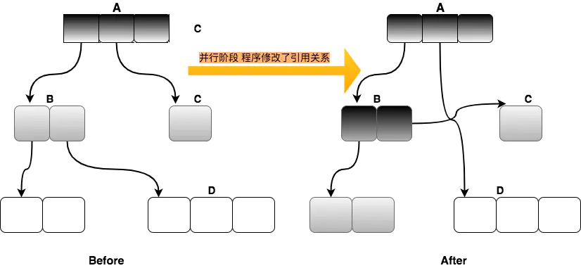

[toc]

#  基础概念

## 运行时数据区域

- JDK8 之前的内存布局


- JDK8 之后的 JVM 内存布局


**JDK8 之前，Hotspot 中方法区的实现是永久代（Perm），JDK8 开始使用元空间（Metaspace），以前永久代中字符串常量、类静态变量移至堆内存，其他内容移至元空间，元空间直接在本地内存分配。**

- 内存溢出

  

> 参考：https://www.cnblogs.com/czwbig/p/11127124.html

## 内存模型


## TLAB

TLAB的全称是Thread Local Allocation Buffer，即线程本地分配缓存区，这是一个线程专用的内存分配区域。其本质还是Eden区域，只是从Eden区申请了一块私有区域，用三个指针进行管理：start、top 、end，其中 start 和 end 标识起始位置，top指目前已经使用到的位置，最大值为end。

可以把TLAB理解为一种Eden区域的空间分配策略，线程预先申请空间，后续的空间分配如果在自己独有的空间上进行，不存在竞争，可以大大提高分配效率。当然，线程申请独有空间还是存在竞争关系的，虚拟机采用CAS+失败重试保证操作的原子性。

那么，什么情况下才会在TLAB上直接分配？

先了解下JVM相关参数：

- -XX:+UseTLAB：启用TLAB，默认开启

- -XX:+TLABSize： 设置TLAB大小，JVM会在运行时不断调整，不建议手动设置
- -XX:TLABRefillWasteFraction：TLAB允许浪费空间的比例，默认为64，refill_waste的默认值，运行时会不断调整
- -XX:ResizeTLAB：自动调整TLABRefillWasteFraction阈值，默认开启
- -XX:TLABWasteTargetPercent：设置TLAB空间所占用Eden空间的百分比大小，默认是1%
- XX:+PrintTLAB：查看TLAB信息

分配规则：

- obj_size + tlab_top <= tlab_end：直接在TLAB空间分配对象
- obj_size + tlab_top > tlab_end  
  -  tlab_free > tlab_refill_waste_limit：tlab剩余可用空间>tlab可浪费空间，当前线程不能丢弃当前TLAB，本次申请交由Eden区分配空间，下次遇到满足条件的小对象接着用
    - tlab_free：剩余的内存空间，即tlab_end -  tlab_top
    - tlab_refill_waste_limit：允许浪费的内存空间，由-XX:TLABRefillWasteFraction决定，默认TLAB的1/64，运行时会不断调整
  - tlab_free <= _refill_waste_limit：重新分配一块TLAB空间，在新的TLAB中分配对象，原TLAB就交给Eden管理

## 逃逸分析

```java
public class EscapeAnalysis {

    public static Object object;

    public Object methodEscape1() {  // 方法逃逸：方法返回值逃逸
        return new Object();
    }

    public Object methodEscape2() {  // 方法逃逸：作为参数传递到其它方法中
        Object object=new Object();
        xxx(object)
    }

    public void threadEscape1() {// 线程逃逸：赋值给类变量
        object = new Object();
    }
    
    public void threadEscape2() { // 线程逃逸：其他线程中访问的实例变量
        Object obj=new Object();
        new Thread(() -> xxx(obj)).start();
    }
    
    public void eliminate1() { // o未逃逸，可自动清除锁
        Object o=new Object();
        synchronized (o){
            xxx();
        }
    }
 
    public void eliminate2() { // buffer未逃逸，append操作加锁可自动清除锁
        StringBuffer buffer=new StringBuffer();
        buffer.append("hello");
        buffer.append("world");
        buffer.append("!");
    }
    
    /**
    * foo未逃逸，可通过标量替换进行优化
    */
    publicint bar(int x) { 
        Foo foo = new Foo(); 
        foo.a = x; 
        return foo.a;
        // 优化后代码
        int a = x; 
        return a;
    }
}
```

> 1. 逃逸分析缺点：不能保证逃逸分析的性能收益必定高于它的消耗
> 2. 逃逸分析作用：
>
> - 锁消除：-XX:+EliminateLocks开启（JDK8默认开启），-XX:-EliminateLocks关闭
> - 标量替换：把不存在逃逸的对象拆散，将成员变量恢复到基本类型，直接在栈上创建若干个成员变量。分层编译()和逃逸分析在1.8中是默认是开启。参数：-XX:+EliminateAllocations
> - 栈上分配：目前Hotspot并没有实现真正意义上的栈上分配，实际上是标量替换。栈上分配随着方法结束而自动销毁，垃圾回收压力减小
> 3. XX:+DoExcapeAnalysis：开启逃逸分析，默认开启，可通过-XX:-DoEscapeAnalysis关闭
> 4. XX:PrintEscapeAnalysis：查看分析结果

## 分层编译

从 Java 7 开始，HotSpot 默认采用分层编译的方式：系统执行初期热点方法优先使用C1编译器，以便尽快进入编译执行。随着时间推移，执行频率较高的代码再被C2编译器编译，以达到最佳性能。

C1、C2都是即时编译器，会将其中反复执行的热点代码，以方法为单位进行即时编译，翻译成机器码后直接运行在底层硬件之上。C2编译器需要收集大量统计信息用于编译优化，相对C1比较耗时，但运行效果更好。

热点方法是由JVM统计每个方法被调用的次数，超过多少次，就是热点方法。默认的分层编译应该是达到两千调C1，达到一万五调C2。

# 对象创建

.png)

- 类加载过后可以直接确定一个对象的大小
- 对象栈上分配是通过逃逸分析判定、标量替换实现的，即把不存在逃逸的对象拆散，将成员变量恢复到基本类型，直接在栈上创建若干个成员变量
- 选择哪种分配方式由Java堆是否规整决定，而Java堆是否规整又由所采用的垃圾收集器是否带有压缩整理 功能决定。因此，在使用Serial、ParNew等带Compact过程的收集器时，系统采用的分配算法是指针碰撞，而使用 CMS这种基于Mark-Sweep算法的收集器时，通常采用空闲列表
- 空间并发分配解决方案
  - TLAB，线程私有空间分配，只有TLAB用完并分配新的TLAB时，才需要同步锁定
  - CAS+失败重试保证更新操作的原子性

# 对象内存布局

## 内存布局


- Klass Word（类指针）：存储对象的类型指针，该指针指向它的类元数据。从JDK 1.6 update14开始，64位的JVM正式支持了-XX:+UseCompressedOops（默认开启），可以压缩指针，起到节约内存占用的作用。oop(ordinary object pointer)即普通对象指针，下列指针将压缩至32位：
  - 每个Class的属性指针（静态成员变量）
  - 每个对象的属性指针（对象变量）
  - 普通对象数组的每个元素指针

- 指针压缩：
  - 如果GC堆大小在4G以下，直接砍掉高32位，避免了编码解码过程(偏移量除以/乘以8)
  - 如果GC堆大小在4G以上32G以下，则启用-XX:+UseCompressedOops命令
  - 如果GC堆大小大于32G，压指失效，使用原来的64位

- -XX:+UseCompressedClassPointers
  - Java8使用Metaspace存储元数据，开启后类元信息中的指针也用32bit的Compressed版本，即Klass Word
  - 依赖-XX:+UseCompressedOops

- 数组长度64位JVM的情况下也被压缩至32位
- 对齐字节：HotSpot VM的自动内存管理要求对象大小必须是8字节的整数倍，不足时需要对齐填充来补全

## 对象头


- 32位虚拟机占用32个字节，不同状态下各个比特位区间大小有变化
- biased_lock：偏向锁标记，为1时表示对象启用偏向锁
- age：默认情况下，并行GC的年龄阈值为15，并发GC的年龄阈值为6。由于age只有4位，所以最大值为15
- identity_hashcode
  - 采用延迟加载技术，只有在需要时使用System.identityHashCode(Object x)计算后写到该对象头中
  - 偏向锁没有存储HashCode的地方，偏向锁期间调用System.identityHashCode(x)会造成锁升级
  - 轻量级锁和重量级锁所指向的lock record或monitor都有存储HashCode的空间
  - 用户自定义hashCode()方法所返回的值不存在Mark Word中，只针对identity hash code

- thread：持有偏向锁的线程ID
- epoch：偏向锁的时间戳
- ptr_to_lock_record：轻量级锁状态下，指向栈中锁记录的指针
- ptr_to_heavyweight_monitor：重量级锁状态下，指向对象监视器Monitor的指针

## ClassLayout

```java
// 引入依赖
<dependency>
    <groupId>org.openjdk.jol</groupId>
    <artifactId>jol-core</artifactId>
    <version>0.11</version>
</dependency>
        
// 查看对象布局信息        
ClassLayout layout = ClassLayout.parseInstance(new A());
System.out.println(layout.toPrintable());
```

可通过ClassLayout查看对象布局信息，即对象占用空间情况

# 对象访问定位

|                         句柄访问对象                         |                       直接指针访问对象                       |
| :----------------------------------------------------------: | :----------------------------------------------------------: |
|  |  |

- 句柄访问：java堆中会划分一块内存作为句柄池，线程栈中引用中存储的就是对象句柄地址。好处在于对象句柄地址固定，对象移动(垃圾回收时移动对象非常普遍)时仅改变句柄中的实例数据指针
- 直接指针访问：线程栈中引用中存储的直接就是对象地址，好处在于速度更快(Sun HotSpot使用此种)

# 对象回收

## finalize

```java
/** 
*此代码演示了两点： 
*1.对象可以在被GC时自我拯救。 
*2.这种自救的机会只有一次，因为一个对象的finalize()方法最多只会被系统自动调用一次 
*/
public class FinalizeEscapeGC {
    public static FinalizeEscapeGC SAVE_HOOK = null;

    public void isAlive() {
        System.out.println("yes,i am still alive：)");
    }

    @Override
    protected void finalize() throws Throwable {
        super.finalize();
        System.out.println("finalize mehtod executed！");
        FinalizeEscapeGC.SAVE_HOOK = this;
    }

    public static void main(String[] args) throws Throwable {
        SAVE_HOOK = new FinalizeEscapeGC();
        // 对象第一次成功拯救自己
        SAVE_HOOK = null;
        System.gc();
        // 因为finalize方法优先级很低，所以暂停0.5秒以等待它
        Thread.sleep(500);
        if (SAVE_HOOK != null) {
            SAVE_HOOK.isAlive();
        } else {
            System.out.println("no,i am dead");
        }

        // 下面这段代码与上面的完全相同，但是这次自救却失败了
        SAVE_HOOK = null;
        System.gc();
        // 因为finalize方法优先级很低，所以暂停0.5秒以等待它
        Thread.sleep(500);
        if (SAVE_HOOK != null) {
            SAVE_HOOK.isAlive();
        } else {
            System.out.println("no,i am dead");
        }
    }
}
```

- 当对象不可达时，会进行第一次标记并筛选出需要进行finalize的对象（对象已覆盖finalize方法且未被虚拟机调用过）放入F-Queue中，并在稍后由一个由虚拟机自动创建的低优先级Finalizer线程执行它(由虚拟机触发finalize方法)
- 逃脱回收的最后一次机会，重新与引用链建立关系
- 同一个对象finalize只会调用一次
- 代价高昂，不确定性大，不建议使用

## 方法区回收

永久代的垃圾收集主要回收两部分内容：废弃常量和无用的类。判定一个常量是否是“废弃常量”比较简单，而要判定一个类是否是“无用的类”的条件则相对苛刻许多。类需要同时满足下面3个条件才能算是“无用的类”： 

- 该类所有的实例都已经被回收，也就是Java堆中不存在该类的任何实例
- 加载该类的ClassLoader已经被回收
- 该类对应的java.lang.Class对象没有在任何地方被引用，无法在任何地方通过反射访问该类的方法

虚拟机可以对满足上述3个条件的无用类进行回收，这里说的仅仅是“可以”，而并不是和对象一样，不使用 了就必然会回收。是否对类进行回收，HotSpot虚拟机提供了-Xnoclassgc参数进行控制，还可以使用-verbose： class以及-XX：+TraceClassLoading、-XX：+TraceClassUnLoading查看类加载和卸载信息，其中-verbose：class 和-XX：+TraceClassLoading可以在Product版的虚拟机中使用，-XX：+TraceClassUnLoading参数需要FastDebug版 的虚拟机支持。

## 对象存活算法

### 引用计数算法

引用加1，失效减1，实现简单，判定效率很高。主流的JVM的内存管理不采用，因为它很难解决对象之间的循环引用

```java
public class ReferenceCountingGC {

    public Object instance = null;
    private static final int _1MB = 1024 * 1024;
    /**
     * 这个成员属性的唯一意义就是占点内存，以便能在GC日志中看清楚是否被回收过
     */
    private byte[] bigSize = new byte[2 * _1MB];

    public static void testGC() {
        ReferenceCountingGC objA = new ReferenceCountingGC();
        ReferenceCountingGC objB = new ReferenceCountingGC();
        objA.instance = objB;
        objB.instance = objA;
        objA = null;
        objB = null; 
        //假设在这行发生GC,objA和objB是否能被回收？ 
        System.gc(); 
    }
}
```

### 可达性分析算法

通过一系列称为“GC ROOTS”(**虚拟机栈中引用的对象、方法区静态属性/常量引用的对象、本地方法栈中JNI(Native方法)引用的对象**)的对象作为起点，向下搜索，所走过的路径称为引用链，当一个对象不在引用链上即不可用。

在JDK 1.2之后，Java对引用的概念进行了扩充

- 强引用：通常使用的是强引用，垃圾回收器不会回收掉被引用的对象

- 软引用：SoftReference<T>，可用但不必需的对象，系统将要发生内存溢出之前进行二次回收

- 弱引用：WeakReference<T>，通过WeakReference与对象T建立弱引用关系，当对象T的强引用失效后，下一次垃圾回收之前弱引用将失效，非必需对象，只能生存在下一次垃圾回收之前。

  ```java
  // a为根对象，或者在引用链上
  A a = new A();
  
  // b为根对象，或另一条引用链上可达对象，a在其引用链上
  B b = new B(a);
  
  // 相当于栈上指针赋值为空，对象实际还存在堆上，第一条引用链上已经不可达
  a = null;
  
  // 经过以上三步，对象A不能被回收，因为B引用了对象A，在B所在的引用链上还是可达的
  ```
  
  ```java
  A a = new A();
  
  // 引用a时，创建一个弱引用
  WeakReference wr = new WeakReference(a);
  
  a=null;
  
  // 当a=null ，这个时候A只被弱引用依赖，那么GC会立刻回收A这个对象
  ```
  
- 虚引用：PhantomReference<T>，不对其生存时间构成影响，也无法通过虚引用获取对象实例。目的就是能在这个对象被回收时收到一个系统通知。虚引用必须和引用队列（ReferenceQueue）联合使用。当垃圾回收器准备回收一个对象时，如果发现它还有虚引用，就会在回收对象的内存之前，把这个虚引用加入到与之 关联的引用队列中。

  ```java
  ReferenceQueue queue = new ReferenceQueue ();
  
  PhantomReference pr = new PhantomReference (object, queue);
  ```

## 垃圾收集算法

- 标记-清除算法

- - 标记出所有要回收的对象，在标记完成后统一回收所有标记的对象。
  - 不足：标记和清除的效率都不高、清除后会产生大量不连续的内存碎片（分配较大对象时有可能由于没有足够的连续内存而提前触发垃圾回收）

- 复制算法

- - 原理：把内存分为大小相等的两块，每次只使用其中的一块，当使用完后，就把还存活的对象复制到另一块上，然后把已使用过的内存空间一次清理掉
  - 好处：每次都对整个半区进行回收，不存在空间碎片问题，实现简单，运行高效
  - 缺点：有效内存只有实际的一半，代价高昂、对象存活率较高需要较多的复制操作，效率会变低
  - HotSpot应用：将内存划分为Eden和两块Survivor，默认比例8:1，这样只浪费10%的空间。特殊场景，当存活对象超过10%后，需要老年代进行分配担保

- 标记-整理算法：标记出所有要回收的对象，在标记完成后把所有存活对象向一端移动，然后清理掉其它内存空间

- 分代收集算法：根据对象存活周期的不同将内存划分为几块，采用不同的收集算法

  

  ```java
  -Xms<size>        // 设置初始Java堆大小
  -Xmx<size>        // 设置最大Java堆大小
  -Xss<size>        // 设置每个线程堆栈大小
  -Xmn256m          // 设置年轻代大小
  -XX:SurvivorRatio=8   // suvivor:eden = 2:8
  ```

  

## HotSpot的算法

### OopMap

“Stop The World”对于Java从业人员都很熟悉，其产生的一个重要原因就是在可达性分析期间，不可以出现分析过程中对象引用关系还在不断变化的情况，该点不满足的话分析结果准确性就无法得到保证。

可达性分析需要枚举根节点找出引用链，如果逐个查找效率低下。目前的主流Java虚拟机使用的都是准确式GC，当执行系统停顿下来后，并不需要一个不漏地检查完所有执行上下文和全局的引用位置，虚拟机应当是有办法直接得知哪些地方存放着对象引用。在HotSpot的实现中，用OopMap记录偏移量，在类加载时记录下偏移量的对象类型、编译时在特定位置记录下哪些位置是引用，GC在扫描时就可以直接获取这些信息

### 安全点

在OopMap的协助下，HotSpot可以快速且准确地完成GC Roots枚举，但一个很现实的问题随之而来：可能导致引用关系变化，或者说OopMap内容变化的指令非常多，如果为每一条指令都生成对应的OopMap，那将会需要大量的额外空间，这样GC的空间成本将会变得很高。 

因此，只在特定位置记录，这些位置称为安全点（Safepoint）。这样只有在到达安全点才会暂停，进行GC。

安全点的选定基本上是以程序“是否具有让程序长时间执行的特征”为标准进行选定的，”长时间执行“最明显的特征就是指令序列复用，例如方法调用、循环跳转、异常跳转等。在避免过多安全点的前提下，保证了程序执行时，在不太长的时间内就会遇到可进入GC的Safepoint。

### 中断方式

- 抢先式中断：GC时中断所有线程，如果发现有线程没有进入安全点，恢复线程进入安全点。目前，几乎不使用
- 主动式中断：GC时仅设置一个标志，各个线程进入安全点后轮询标志，为真自动中断挂起

### 安全区

主动式中断需要线程是活动的，当线程处于Sleep或者Blocked状态，无法响应中断请求。JVM也显然不太可能等待线程重新被分配CPU时间。对于这种情况，就需要安 全区域（Safe Region）来解决。

安全区域是指在一段代码片段之中，引用关系不会发生变化。在这个区域中的任意地方开始GC都是安全的。我们也可以把Safe Region看做是被扩展了的Safepoint。 

当线程进入安全区，首先标志自己已进入，这样GC时就会忽略这样的线程；当线程离开安全区时，判断是否已完成根节点枚举或者整个GC过程，等完成后再离开

## 垃圾回收器


- 查看JDK默认垃圾回收器

```java
java -XX:+PrintCommandLineFlags -version

-XX:InitialHeapSize=266608064 -XX:MaxHeapSize=4265729024 -XX:+PrintCommandLineFlags 
-XX:+UseCompressedClassPointers -XX:+UseCompressedOops -XX:-UseLargePagesIndividualAllocation -XX:+UseParallelGC
java version "1.8.0_162"
Java(TM) SE Runtime Environment (build 1.8.0_162-b12)
Java HotSpot(TM) 64-Bit Server VM (build 25.162-b12, mixed mode)
```

- 查看GC日志明细

  ```java
  java -XX:+PrintGCDetails -version
  
  java version "1.8.0_162"
  Java(TM) SE Runtime Environment (build 1.8.0_162-b12)
  Java HotSpot(TM) 64-Bit Server VM (build 25.162-b12, mixed mode)
  Heap
   PSYoungGen      total 76288K, used 2621K [0x000000076b380000, 0x0000000770880000, 0x00000007c0000000)
    eden space 65536K, 4% used [0x000000076b380000,0x000000076b60f748,0x000000076f380000)
    from space 10752K, 0% used [0x000000076fe00000,0x000000076fe00000,0x0000000770880000)
    to   space 10752K, 0% used [0x000000076f380000,0x000000076f380000,0x000000076fe00000)
   ParOldGen       total 175104K, used 0K [0x00000006c1a00000, 0x00000006cc500000, 0x000000076b380000)
    object space 175104K, 0% used [0x00000006c1a00000,0x00000006c1a00000,0x00000006cc500000)
   Metaspace       used 2348K, capacity 4480K, committed 4480K, reserved 1056768K
    class space    used 254K, capacity 384K, committed 384K, reserved 1048576K
  ```

- 垃圾回收器常用组合

  | 新生代            | 老年代       | JDK7参数                     | JDK8参数                                                |
  | ----------------- | ------------ | ---------------------------- | ------------------------------------------------------- |
  | Serial            | Serial Old   | -XX:+UseSerialGC             | -XX:+UseSerialGC                                        |
  | ParNew            | Serial Old   | -XX:+UseParNewGC             | 不支持该组合                                            |
  | Parallel Scavenge | Serial Old   | 默认 或者 -XX:+UseParallelGC | -XX:-UseParallelOldGC                                   |
  | Parallel Scavenge | Parallel Old | -XX:+UseParallelOldGC        | 默认 或者 -XX:+UseParallelGC 或者 -XX:+UseParallelOldGC |
  | ParNew            | CMS          | -XX:+UseConcMarkSweepGC      | -XX:+UseConcMarkSweepGC                                 |
  | G1                | G1           | -XX:+UseG1GC                 | -XX:+UseG1GC（JDK9默认）                                |

- 垃圾回收器参数设置

  |               参数名称                |                             含义                             |
  | :-----------------------------------: | :----------------------------------------------------------: |
  |   **-verbose:gc 或者 -XX:+PrintGC**   |  **开启简单GC日志模式，简单模式的GC日志格式是与GC算法无关**  |
  |        **-XX:+PrintGCDetails**        |  **开启详细GC日志模式，详细模式的GC日志格式是与GC算法有关**  |
  |      **-XX:+PrintGCTimeStamps**       |                  **打印JVM启动至今的秒数**                   |
  |      **-XX:+PrintGCDateStamps**       |                   **打印绝对的日期和时间**                   |
  |  -XX:+PrintGCApplicationStoppedTime   |                打印垃圾回收期间程序暂停的时间                |
  | -XX:+PrintGCApplicationConcurrentTime |           打印每次垃圾回收前，程序未中断的执行时间           |
  |          -XX:+PrintHeapAtGC           |                 在进行GC的前后打印出堆的信息                 |
  |         **-Xloggc:filename**          | **缺省的GC日志时输出到终端，使用-Xloggc:将日志输出到指定的文件** |

  > [Java 1.8 常用GC参数速查表](https://github.com/caison/caison-blog-demo/tree/master/gc-demo)
  >
  > [G1调优常用参数及其作用](https://blog.csdn.net/qq_27529917/article/details/87072130)
  >
  > [Java HotSpot VM Options](https://www.oracle.com/java/technologies/javase/vmoptions-jsp.html)
  >
  > [XXFox](https://opts.console.perfma.com/) 

- 垃圾收集器在GC日志中的别名

  |           新生代（别名）            |        老年代（别名）         |
  | :---------------------------------: | :---------------------------: |
  |        **Serial（DefNew）**         |  **Serial Old（PSOldGen）**   |
  |          ParNew（ParNew）           |    Serial Old（PSOldGen）     |
  |   Parallel Scavenge（PSYoungGen）   |    Serial Old（PSOldGen）     |
  | **Parallel Scavenge（PSYoungGen）** | **Parallel Old（ParOldGen）** |
  |        **ParNew（ParNew）**         |        **CMS（CMS-）**        |
  |               **G1**                |            **G1**             |

- 理解GC日志

  ```java
  // 两种格式的时间，分别是绝对时间和JVM启动至今的秒数
  2019-04-22T10:10:09.596+0800: 224481.666:
  /** 
  * GC：表示发生了新生代GC（Minor GC）
  * Allocation Failure：触发GC原因，空间分配失败
  * PSYoungGen：表示新生代采用Parallel Scavenge垃圾回收器
  * 107264K->11752K(117248K)：表示“GC前该内存区域已使用容量 -> GC后该内存区域已使用容量（该内存区域总容量）”
  * 222768K->137086K(248320K)：表示“GC前堆已使用容量 -> GC后堆已使用容量（堆总容量）”
  * 0.0147190 secs：表示该区域GC所占用的时间，单位是秒
  */
  [GC (Allocation Failure) [PSYoungGen: 107264K->11752K(117248K)] 222768K->137086K(248320K),0.0147190 secs]
  /** 
  * user：用户态消耗CPU的时间（GC线程消耗CPU的总时间）
  * sys：内核态消耗CPU的时间（GC过程中操作系统调用和系统等待事件所消耗的总时间）
  * real：操作从开始到结束所经过的墙钟时间（应用程序暂停的时间）
  */
  [Times: user=0.08 sys=0.02, real=0.02 secs]
  
  /**
  * Full GC：同时发生了新生代GC（Minor GC）和老年代GC（Major GC）
  * Ergonomics：GC自适应的调节策略
  * PSYoungGen：新生代采用Parallel Scavenge垃圾回收器
  * ParOldGen：老年代Parallel Old垃圾回收器
  * Metaspace：元数据区
  */
  2019-04-22T10:10:09.611+0800: 224481.680:
  [Full GC (Ergonomics)[PSYoungGen: 11752K->0K(117248K)]
  [ParOldGen: 125333K->108014K(131072K)] 137086K->108014K(248320K),
  [Metaspace: 107143K->107091K(1144832K)],0.2168020 secs]
  // 同上
  [Times: user=0.66 sys=0.01, real=0.21 secs]
  ```

### Serial 收集器

Serial收集器是最基本的、发展历史最悠久的收集器。

**特点：**单线程、简单高效（与其他收集器的单线程相比），对于限定单个CPU的环境来说，Serial收集器由于没有线程交互的开销，专心做垃圾收集自然可以获得最高的单线程收集效率。收集器进行垃圾回收时，必须暂停其他所有的工作线程，直到它结束（Stop The World）。

**应用场景**：适用于Client模式下的虚拟机。

**Serial / Serial Old收集器运行示意图**

 

### ParNew收集器

ParNew收集器其实就是Serial收集器的多线程版本。

除了使用多线程外其余行为均和Serial收集器一模一样（参数控制、收集算法、Stop The World、对象分配规则、回收策略等）。

**特点**：多线程、ParNew收集器默认开启的收集线程数与CPU的数量相同，在CPU非常多的环境中，可以使用-XX:ParallelGCThreads参数来限制垃圾收集的线程数。和Serial收集器一样存在Stop The World问题

**应用场景**：ParNew收集器是许多运行在Server模式下的虚拟机中首选的新生代收集器，因为它是除了Serial收集器外，唯一一个能与CMS收集器配合工作的。

**ParNew/Serial Old组合收集器运行示意图如下：**

 

### Parallel Scavenge 收集器

与吞吐量关系密切，故也称为吞吐量优先收集器。

**特点**：属于新生代收集器也是采用复制算法的收集器，又是并行的多线程收集器（与ParNew收集器类似）。该收集器的目标是达到一个可控制的吞吐量。还有一个值得关注的点是：GC自适应调节策略（与ParNew收集器最重要的一个区别）

**GC自适应调节策略**：Parallel Scavenge收集器可设置-XX:+UseAdptiveSizePolicy参数。当开关打开时不需要手动指定新生代的大小（-Xmn）、Eden与Survivor区的比例（-XX:SurvivorRation）、晋升老年代的对象年龄（-XX:PretenureSizeThreshold）等，虚拟机会根据系统的运行状况收集性能监控信息，动态设置这些参数以提供最优的停顿时间和最高的吞吐量，这种调节方式称为GC的自适应调节策略。

Parallel Scavenge收集器使用两个参数控制吞吐量：

- XX:MaxGCPauseMillis：控制最大的垃圾收集停顿时间
- XX:GCRatio：直接设置吞吐量的大小。

### Serial Old 收集器

Serial Old是Serial收集器的老年代版本。

**特点**：同样是单线程收集器，采用标记-整理算法。

**应用场景**：主要也是使用在Client模式下的虚拟机中。也可在Server模式下使用。

**Server模式下主要的两大用途**：

1. 在JDK1.5以及以前的版本中与Parallel Scavenge收集器搭配使用。
2. 作为CMS收集器的后备方案，在并发收集Concurent Mode Failure时使用。

**Serial / Serial Old收集器工作过程图（Serial收集器图示相同）**：

****

### Parallel Old 收集器

Parallel Scavenge收集器的老年代版本。

**特点**：多线程，采用标记-整理算法。

**应用场景**：注重高吞吐量以及CPU资源敏感的场合，都可以优先考虑Parallel Scavenge+Parallel Old 收集器。

**Parallel Scavenge/Parallel Old收集器工作过程图：**

****

### CMS收集器

CMS（Concurrent Mark Sweep）收集器是一种以获取最短回收停顿时间为目标的收集器

**特点**：基于标记-清除算法实现，并发收集、低停顿，适用于I/O密集型

**应用场景**：适用于注重服务的响应速度，希望系统停顿时间最短，给用户带来更好的体验等场景下。如web程序、b/s服务。

**CMS收集器的运行过程分为下列4步：**

- **初始标记**：标记GC Roots能直接到的对象。速度很快但是仍存在Stop The World问题。
- **并发标记**：进行GC Roots Tracing 的过程，找出存活对象且用户线程可并发执行。
- **重新标记**：为了修正并发标记期间因用户程序继续运行而导致标记产生变动的那一部分对象的标记记录，仍然存在Stop The World问题。
- **并发清除**：对标记的对象进行清除回收。

 CMS收集器的内存回收过程是与用户线程一起并发执行的。在CMS中，也有RSet的概念，在老年代中有一块区域用来记录指向新生代的引用。这是一种point-out，在进行Young GC时，扫描根时，仅仅需要扫描这一块区域，而不需要扫描整个老年代。

 **CMS收集器的工作过程图：**

 

> 图中**初始化标记**阶段是串行的，这是JDK7的行为。JDK8以后默认是并行的，可以通过参数`-XX:+CMSParallelInitialMarkEnabled`控制。

**CMS收集器的缺点：**

- 并发阶段会占用一部分线程（CPU资源资源），默认启动回收线程（CPU数+3）/4，CPU负载高时不适用
- 无法处理浮动垃圾，因为并发清除时用户线程还在运行，垃圾不断产生，可能出现“Concurrent Mode Failure”失败而导致另一次的Full GC。JDK1.5默认设置下，CMS收集器当老年代使用了68%会激活，1.6启动阈值提高到92%（老年代增长不是太快）。当CMS运行期间预留内存无法满足程序运行时，就会出现上述错误，这时虚拟机将临时启动Serial Old收集器，造成停顿时间过长
- 标记-清除算法会产生空间碎片，因此提供了UseCMSCompactAtFullCollection开关参数，CMS收集器顶不住进行Full GC时开启内存碎片合并整理，整理过程无法并发，停顿时间会变长。另外还提供参数CMSFullGCsBeforeCompaction，用于设置执行多少次不压缩的Full GC后执行一次压缩的（默认0，每次进入Full GC都进行碎片整理）

### G1收集器

一款面向服务端应用的垃圾收集器，其首要目标是为需要大量内存的系统提供一个保证 GC 低延迟的解决方 ，也就是说堆内存在 6GB 及以上，稳定和可预测的暂停时间小于 0.5 秒。

G1将内存划分成了多个大小相等的Region(1~32M，默认数量2048个)，Region逻辑上连续，物理内存地址不连续。同时每个Region被标记成E、S、O、H，分别表示Eden、Survivor、Old、Humongous。其中E、S属于年轻代，O与H属于老年代，H表示大对象，**当分配的对象大于等于Region大小的一半**的时候就会被认为是巨型对象。


**特点如下：**

- 并行与并发：G1能充分利用多CPU、多核环境下的硬件优势，使用多个CPU来缩短Stop-The-World停顿时间。部分收集器原本需要停顿Java线程来执行GC动作，G1收集器仍然可以通过并发的方式让Java程序继续运行。
  - 并行（Parallel）：指多条垃圾收集线程并行工作，但此时用户线程仍然处于等待状态。 
  - 并发（Concurrent）：指用户线程与垃圾收集线程同时执行（但不一定是并行的，可能会交替执行），用户程序在继续运行，而垃圾收集程序运行于另一个CPU上
- 分代收集：G1能够独自管理整个Java堆，并且采用不同的方式去处理新创建的对象和已经存活了一段时间、熬过多次GC的旧对象，以获取更好的收集效果。

- 空间整合：G1运作期间不会产生空间碎片，收集后能提供规整的可用内存。

- 可预测的停顿：G1除了追求低停顿外，还能建立可预测的停顿时间模型。能让使用者明确指定在一个长度为M毫秒的时间段内，消耗在垃圾收集上的时间不得超过N毫秒。

**G1为什么能建立可预测的停顿时间模型？**

因为它有计划的避免在整个Java堆中进行全区域的垃圾收集。G1跟踪各个Region里面的垃圾堆积的大小，在后台维护一个优先列表，每次根据允许的收集时间，优先回收价值最大的Region。这样就保证了在有限的时间内可以获取尽可能高的收集效率。

**G1与其他收集器的区别？**

其他收集器的工作范围是整个新生代或者老年代，G1收集器的工作范围是整个Java堆。在使用G1收集器时，它将整个Java堆划分为多个大小相等的独立区域（Region）。虽然也保留了新生代、老年代的概念，但新生代和老年代不再是相互隔离的，他们都是一部分Region（不需要连续）的集合。

**G1收集器存在的问题？**

Region不可能是孤立的，分配在Region中的对象可以与Java堆中的任意对象发生引用关系。在采用可达性分析算法来判断对象是否存活时，得扫描整个Java堆才能保证准确性。其他收集器也存在这种问题（G1更加突出而已），会导致Minor GC效率下降。

**G1收集器是如何解决上述问题的？**

采用Remembered Set来避免整堆扫描。G1中每个Region都有一个与之对应的Remembered Set，虚拟机发现程序在对Reference类型进行写操作时，会产生一个**Write Barrier（写屏障）**暂时中断写操作，检查Reference引用对象是否处于多个Region中（即检查老年代中是否引用了新生代中的对象），如果是，便通过CardTable把**相关引用信息记录到被引用对象所属的Region的Remembered Set中**。当进行内存回收时，在GC根节点的枚举范围中加入Remembered Set即可保证不对全堆进行扫描也不会有遗漏。


首先了解Card相关概念，如下：

- Card：GI GC 区间里的最小单元，512 Byte，多个Card构成一个Region
- Card Table：一个比特位的集合，每一个比特位映射一个Card，卡表位为1表示引用了其他Card中对象

上图展示的是`RSet`与`Card`的关系。每个`Region`被分成了多个`Card`（512 Byte），其中绿色部分的`Card`表示该`Card`中有对象引用了其他`Card`中的对象，这种引用关系用蓝色实线表示。`RSet`其实是一个HashTable，Key是引用对象所属Region的起始地址，Value是一个集合，里面的元素是Card Table 数组中的index，既Card对应的Index，映射到对象的Card地址。例如：对上图中Region2进行回收，扫描其对应的Rset，可以得到两个key，分别对应Region1、Region3的起始地址，即可以定位到有引用Region2的Region。然后再通过Rset中对应的Value，可以得出Region1、Region3中具体引用对象所属Card的地址，直接扫描对应的Card即可得到与当前Region中对应的引用关系，极大的缩小了扫描范围。

Gl GC 只在以下两个场景依赖 RSet

- 老年代到年轻代的引用： G1 GC 维护了从老年代区间到年轻代区间的指针，这个指针保存在年轻代的 RSet 里面
- 老年代到老年代的引用： Gl GC 维护了从老年代区间到老年代区间的指针，这个指针保存在老年代的 RSet 里面

年轻代到老年代的引用不依赖RSet，因为年轻代会被完整回收，回收过程中会完整扫描，没有必要额外占用空间去记录年轻代引用了哪些老年代对象

**如何保证在并发标记阶段的正确性？**

CMS GC 和G1 GC算法都是通过对gc root进行遍历，并把对象分成三种颜色：

- 黑色(black)：自身以及可达对象都已经被标记
- 灰色(gray)：自身被标记，可达对象还未标记
- 白色(white)：还未被标记

但是并发标记过程中以下情况可能出现白色对象漏标的情况：

- 并发标记时，应用线程给一个黑色对象的引用类型字段赋值了该白色对象
- 并发标记时，应用线程删除所有灰色对象到该白色对象的引用



观察上图，对象D删除了与所有灰色对象的引用，且又建立了与黑色对象的引用，由于黑色对象已经扫描过了，灰色对象到对象D又不可达，就会出现漏标的情况，标记结束对象D还是白色，会被回收掉，影响程序正确性。

针对以上情况，CMS GC 和G1 GC算法都是通过写屏障，记录新增的引用关系和即将被删除的引用关系，即引用变动情况。差异在于如下：

- CMS GC通过Incremental Update write barrier把新增引用的黑色对象重新标记为灰色，让收集器重新扫描。

- G1 GC通过STAB（snapshot-at-the-beginning），在GC开始时对内存进行一个对象图的逻辑快照(snapshot)，通过GC Roots tracing 并发标记的过程，只要被快照到对象是活的，那在整个GC的过程中对象就被认定的是活的，即使该对象的引用稍后被修改或者删除。同时新分配的对象也会被认为是活的，除此之外其它不可达的对象就被认为是死掉了。这样STAB就保证了真正存活的对象不会被GC误回收，但同时也造成了某些可以被回收的对象逃过了GC，导致了内存里面存在浮动的垃圾

**如果不计算维护 Remembered Set 的操作，G1收集器大致可分为如下步骤：**

- **初始标记**：仅标记GC Roots能直接关联到的对象，并且修改TAMS（Next Top at Mark Start）的值，让下一阶段用户程序并发运行时，能在正确可用的Region中创建新对象（需要停顿线程，但耗时很短）
- **并发标记**：从GC Roots开始对堆中对象进行可达性分析，找出存活对象（耗时较长，但可与用户程序并发执行）

- **最终标记**：为了修正在并发标记期间因用户程序执行而导致标记产生变化的那一部分标记记录，对象的变化记录在线程Remembered Set Logs里面，最终把Remembered Set Logs里面的数据合并到Remembered Set中（需要线程停顿，但可并行执行）
- **筛选回收**：对各个Region的回收价值和成本进行排序，根据用户所期望的GC停顿时间来制定回收计划。可以做到与用户程序一起并发执行，但是因为只回收一部分Region，时间是用户可控制的，而且停顿用户线程将大幅提高收集效率。

**G1收集器运行示意图：**

 

#### Young GC

Young GC 回收的是所有年轻代的Region。**当E区不能再分配新的对象时就会触发**，E区的对象会移动到S区。当S区空间不够的时候，E区的对象会直接晋升到O区，同时S区的数据移动到新的S区，如果S区的部分对象到达一定年龄，会晋升到O区。YGC的过程采用多线程并发复制对象

Yung GC过程示意图如下：


#### Mixed GC

Mixed GC 翻译过来叫混合回收，之所以叫混合是因为回收所有的年轻代的Region+部分老年代的Region。

1、为什么是老年代的部分Region？

回收部分老年代是参数`-XX:MaxGCPauseMillis`，用来指定一个G1收集过程目标停顿时间，默认值200ms，当然这只是一个期望值。G1的强大之处在于他有一个停顿预测模型（Pause Prediction Model），他会有选择的挑选部分Region，去尽量满足停顿时间。

2、什么时候触发Mixed GC?

Mixed GC的触发也是由一些参数控制。比如`XX:InitiatingHeapOccupancyPercent`表示老年代占整个堆大小的百分比，默认值是45%，达到该阈值就会触发一次Mixed GC。

Mixed GC主要可以分为两个阶段：

1、全局并发标记（global concurrent marking），全局并发标记又可以进一步细分成下面几个步骤：

- 初始标记（lnitial Marking，STW）：利用新生代收集的 STW 时间段，并发地进行标记从 GC Root 开始直接可达的对象（原生栈对象、全局对象、JNI 对象）
- 根区域扫描（Root Region Scanning）：在初始标记（借用新生代STW）暂停结束后，新生代收集也完成的对象复制到 Survivor 的工作，应用线程开始活跃起来。此时为了保证标记算法的正确性，所有新复制到 Survivor 分区的对象，需要找出哪些对象存在对老年代对象的引用，把这些对象标记成根（Root）
- 并发标记（Concurrent Marking）：从GC Root开始对heap中的对象标记，标记线程与应用程序线程并行执行，并且收集各个Region的存活对象信息。过程中还会扫描上文中提到的SATB write barrier所记录下的引用（可能会被若干次新生代垃圾收集打断）
- 重标记（Remarking，STW）：标记在并发标记阶段发生变化的对象，和所有未被标记的存活对象，同时完成存活数据计算
- 清除（Cleanup）
  - 整理更新每个 Region 各自的 RSet（Remember Set，HashMap 结构，记录有哪些老年代对象指向本 Region，key 为指向本 Region 的对象的引用，value 为指向本 Region 的具体 Card 区域，通过 RSet 可以确定 Region 中对象存活信息，避免全堆扫描）
  - 回收不包含存活对象的 Region

2、拷贝存活对象（Evacuation）

Evacuation阶段是全暂停的。它负责把一部分region里的活对象拷贝到空region里去（并行拷贝），然后回收原本的region的空间。Evacuation阶段可以自由选择任意多个region构成收集集合（collection set，简称CSet）来独立收集，CSet集合中Region的选定依赖于上文中提到的**停顿预测模型**，该阶段并不evacuate所有有活对象的region，只选择收益高的少量region来evacuate，这种暂停的开销就可以（在一定范围内）可控。

Mixed GC的清理过程示意图如下：


#### Full GC

G1的垃圾回收过程是和应用程序并发执行的，当Mixed GC的速度赶不上应用程序申请内存的速度的时候，Mixed G1就会降级到Full GC，使用的是Serial GC。Full GC会导致长时间的STW，应该要尽量避免。导致G1 Full GC的原因可能有：

1. 程序主动执行 System.gc
2. 全局并发标记期间老年代空间被填满（并发模式失败）
3. Mixed GC 期间老年代空间被填满（晋升失败）
4. Young GC 时 Survivor 空间和老年代没有足够空间容纳存活对象

#### 日志解析

> https://www.jianshu.com/p/ac1ba3479c08

### ZGC

#### 亮点

ZGC(Z Garbage Collector)作为一种比较新的收集器，JDK 11开始支持。目前还没有得到大范围的关注。作为一款低延迟的垃圾收集器，它有如下几个亮点：

- 停顿时间不会超过 10ms
- 停顿时间不会随着堆的增大而增大（控制停顿时间在10ms内）
- 支持堆的大小范围很广（4TB，JDK13增加到16TB）
- 对吞吐量影响最大不超过15%（Load Barriers导致应用吞吐量降低）

#### 堆布局及对象分配

ZGC不会像G1那样在一开始就被划分为固定大小的region，ZGC是根据对象的大小，动态的创建不同大小的Page页（ZPage），其大小为N*2MB，有三种形态：

- Small Page：2MB，256k以下的对象分配在Small Page，每个CPU会关联一个Small page，线程在分配对象时，先查找线程所运行在的cpu id, 找到关联的Page进行分配。page剩余内存不够时，会尝试在新Page分配并切换cpu绑定的page为新的page（NUMA架构，CPU对应一块最近的内存，减少竞争）
- Medium Page：32MB，当对象size小于等于4M时（32M / 8），在medium page分配
- Large：N*2MB，4M以上的对象在Large Page分配，每个large对象占用一个Page， 根据对象大小先分配合适大小的Page，然后在Page中分配对象

上述分配策略属于ZCollectedHeap::mem_allocate（慢速分配），同时还有一种ZCollectedHeap::allocate_new_tlab（快速分配）

因此，ZGC下堆由不规整的ZPage构成，结构如下：


#### ZGC过程


向下箭头表示STW, 横向箭表示并发阶段

##### Mark

标记，标记所有活跃的对象，记录在对应Page的Livemap（活对象表，bitmap实现）中，并把对象的Reference（引用）都改成已标记（Marked0或Marked1）状态。

Mark又细分为以下两个阶段：

- **Pause Mark Start －初始停顿标记**：**第一次STW**，停顿JVM标记GC Roots（一组必须活跃的引用，3、6已经不活跃了），1，2，4三个被标为live


- **Concurrent Mark－并发标记**：并发标记其他对象，5和8也被标记为live


​		并发标记后，**第二次STW**，有一个短暂的暂停（Pause Mark End），确保所有对象都被标记

##### Relocate

迁移，根据页面中活跃对象占用的大小选出的一组Page，将其中活跃对象都复制到新的Page, 并在额外的forward table（转移表）中记录对象原地址和新地址对应关系

Relocate可细分为以下三个阶段：

- **Concurrent Prepare for Relocate－迁移前准备**：并发选取需要标记整理的Region集合（Relocation Set），3、6、7是过期对象，因此灰色的Region需要被清理。被选中的Region使用转移表Forwarding Tables记录迁移地址的映射，由于Mark和Remap重合，指针修正后，会释放上一阶段中Forwarding Tables资源


- **Pause Relocate Start－root迁移**：**第三次STW**，迁移Root中的对象，在Forwarding Tables中记录新老地址的映射，不会停顿太长时间


- **Concurrent Relocate－并发迁移**：把Page内的活跃对象并发迁移到新的Region中，完成后Page可以立即重用


​		**GC Cycle Completed**，循环迁移Relocation Set中活跃对象，回收Region，整个Relocate完成


​		**注意：此时部分数据指针通过转移表Forwarding Tables映射，2、4、5都需要通过转移表才可以定位到实际数据位置**

##### Remap

重映射，把所有已迁移活跃对象的引用重新指向新的正确地址。实现上，由于想要将所有引用都修正过来需要跟Mark阶段一样遍历整个对象图，所以这次的Remap会与下一次的Mark阶段合并。所以在ZGC的实现上只有2个阶段，即Mark&Remap阶段和Relocate阶段

- 下一次Mark时修正指针，2、4直接指向5，5直接指向8


- 指针修正后释放转移表Forwarding Tables中资源


#### ZGC关键技术

与传统的标记对象算法相比，ZGC通过**Colored Pointers（着色指针）**在指针上做标记，在访问指针时加入**Load Barrier（读屏障）**，实现了并发转移。比如当对象正在被GC移动，但对象地址未及时更新，那么应用线程可能访问到旧地址而出错。ZGC在应用线程访问对象时增加“读屏障”，通过着色指针判定对象是否被移动过。如果发现对象被移动了，读屏障就会先把指针更新到新地址再返回（如果还在迁移中，业务线程会协助GC线程迁移）。因此，只有单个对象读取时有概率被减速，而不存在为了保持应用与GC一致而粗暴整体的Stop The World。

```java
Object o = obj.fieldA; // Loading an object reference from heap
// 通过引用访问堆中对象，需要先加一个Load Barrier，判断当前指针是否Bad Color，即对象是否在GC时被移动了，如果移动了，修正指针
<load barrier needed here>

Object p = o; // No barrier，not a load from heap
o.doSomething(); // No barrier，not a load from heap
int i = obj.fieldB; // No barrier，not a object reference
```

> Colored Pointers（着色指针）

在64位系统中，ZGC利用了对象引用中4bit进行着色标记（**低42位：**对象的实际地址，JDK13最大堆由4TB增加到16TB，低44位表示对象实际地址），结构如下：


Colored Pointers（着色指针）用以下几个bits表示：

- **Marked0/marked1:** 判断对象是否已标记，GC周期交替时更换标记位，使上次GC周期标记的状态失效，所有引用都变为未标记
- **Remapped:** 判断指针是否已指向新的地址，不再通过转移表Forwarding Tables映射
- **Finalizable:** 判断对象是否只能被Finalizer访问，即是否实现了finalize()方法

Colored Pointers（着色指针）**001、100、010**在三种状态循环交替

- 001：Marked0作为标记位，标记活跃对象
- 100：Relocation Set中对象迁移完成后记为100，表示迁移完成
- 010：下一个GC周期，切换Marked1作为标记位，把标记为100（上个GC周期迁移的对象）、001（上个周期标记的活跃对象）更新为010

注意事项：

- 由于ZGC利用64位的对象指针，因此，ZGC无法支持32位的操作系统，同样也无法支持压缩指针(CompressedOops)

#### ZGC触发时机

ZGC目前有4中机制触发GC：

- **rule_timer - 定时触发**：默认不生效，通过XX:ZCollectionInterval=1（单位是秒）配置生效，周期性ZGC。适用于应对突增流量场景，例如：定时活动、秒杀场景，日志中关键字是“Timer“

- **rule_warmup - 预热触发**：最多三次，在堆内存达到10%、20%、30%时触发，主要为了收集一些GC相关的数据，为后面的条件规则提供数据支撑，日志中关键字是“Warmup”

- **rule_allocation_rate - 分配速率**：基于对象分配速率的自适应算法，ZGC根据近期的对象分配速率以及GC时间，计算出当内存占用达到什么阈值时触发下一次GC，最主要的GC触发方式。通过参数-XX:ZAllocationSpikeTolerance控制阈值大小，该参数默认2，数值越大，越早的触发GC，日志中关键字是“Allocation Rate”

- **rule_proactive - 主动触发**：默认开启，可通过参数-XX:-ZProactive关闭，日志中关键字是“Proactive”，执行条件如下：
  - 自从上次GC之后，堆的使用量至少涨了10%
  - 自从上次GC之后，已经过去5分钟没有发生GC

以上四种都是内存空闲时执行的GC策略，其他ZGC触发场景如下：

- **阻塞内存分配请求触发**：垃圾回收的速度赶不上对象分配的速率，分配对象的应用线程只能停下来，等待垃圾对象的回收。如果回收掉一部分内存，就可以直接拿来用了，不需要等垃圾回收执行完成。应尽量避免出现这种触发方式，日志中关键字是“Allocation Stall”
- **外部触发**：代码中显式调用System.gc()触发，日志中关键字是“System.gc()”
- **元数据分配触发**：元数据区不足时导致，一般不需要关注，日志中关键字是“Metadata GC Threshold”

#### ZGC参数

示例如下：

```java
// 堆的最大内存和最小内存，这里都设置为10G，程序的堆内存将保持10G不变
-Xms10G -Xmx10G 
// 设置CodeCache的大小，JIT编译的代码都放在CodeCache中，一般服务64m或128m就已经足够    
-XX:ReservedCodeCacheSize=128m -XX:InitialCodeCacheSize=128m 
// 启用ZGC的配置
-XX:+UnlockExperimentalVMOptions -XX:+UseZGC
/**
* 并发回收垃圾的线程(与应用线程一起运行)，默认(ParallelGCThreads + 3)/4。调大后GC变快，但会占用程序运行时的CPU资源，吞吐会受到影响    
* 如果GC间隔时间大于GC周期，不建议调整该参数
*/
-XX:ConcGCThreads=2 
// STW阶段并行线程数，默认：cpu<=8 ? cpu : 8+((cpu-8)*5)/8
-XX:ParallelGCThreads=6 
// 周期性ZGC时间间隔执行，单位秒，默认不生效
-XX:ZCollectionInterval=5
// ZGC触发自适应算法的修正系数，默认2，数值越大，越早的触发ZGC   
-XX:ZAllocationSpikeTolerance=5 
// 是否启用主动回收，默认开启，这里的配置表示关闭（已经配置了周期性执行，主动回收可考虑关闭）    
-XX:+UnlockDiagnosticVMOptions -XX:-ZProactive 
// 设置GC日志中的内容、格式、位置以及每个日志的大小    
-Xlog:safepoint,classhisto*=trace,age*,gc*=info:file=/opt/logs/logs/gc-%t.log:time,tid,tags:filecount=5,filesize=50m 
```

可以调优的参数比较少，大部分工作JVM能很好的自动完成，其他参数如下：


## 内存分配和回收策略

- 对象优先在Eden分配
- 大对象直接进入老年代 ，参数：-XX：PretenureSizeThreshold，只对Serial和ParNew两款收集器有效
- 长期存活的对象将进入老年代，参数：-XX：MaxTenuringThreshold（默认15），每“熬过”一次Minor GC，年龄就增加1岁
- 动态对象年龄判定，如果在Survivor空间中相同年龄所有对象大小的总和大于Survivor空间的一半，年龄大于或等于该年龄的对象就可以直接进入老年代，无须等到MaxTenuringThreshold中要求的年龄
- 空间分配担保：在发生Minor GC之前，虚拟机会先检查老年代最大可用的连续空间是否大于新生代所有对象总空间，如果这个条件成立，那么Minor GC可以确保是安全的。如果不成立，则虚拟机会查看HandlePromotionFailure设置值是否允许担保失败。如果允许，那么会继续检查老年代最大可用的连续空间是否大于历次晋升到老年代对象的平均大小， 如果大于，将尝试着进行一次Minor GC，尽管这次Minor GC是有风险的；如果小于，或者HandlePromotionFailure 设置不允许冒险，那这时也要改为进行一次Full GC。


GC触发条件：

- 当Eden区满时
- 调用System.gc时，系统建议执行Full GC，但是不必然执行
- 老年代空间不足
- 方法区空间不足（所有实例被回收、加载该类的ClassLoader被回收、Class对象无法通过任何途径访问，包括反射），在未配置为CMS GC的情况下会执行Full GC
- 通过Minor GC后进入老年代的平均大小大于老年代的可用内存
- 由Eden区、From Space区向To Space区复制时，对象大小大于To Space可用内存，则把该对象转存到老年代，且老年代的可用内存小于该对象大小

## JVM调优


**GC调优是最后要做的工作**，GC调优的目的可以总结为下面两点：

- 减少对象晋升到老年代的数量
- 减少FullGC的执行时间

通过监控排查问题及验证优化结果，可以分为：

- 命令监控：jps、jinfo、jstack、jmap、jstat、jhat
- 图形化监控：[JConsole和VisualVM](https://mp.weixin.qq.com/s?__biz=MzI4NDY5Mjc1Mg==&mid=2247484023&idx=1&sn=39be119fdf3132240adc84a85bf8a054&chksm=ebf6da08dc81531e3719389555150f2d0237554b6b6c07a123efdea7c78c0ae2f064cc577bd4&scene=21#wechat_redirect)
- 阿里巴巴开源的 Java 诊断工具：[Arthas（阿尔萨斯）](https://arthas.aliyun.com/doc/)： 

如果GC执行时间满足下列所有条件，就没有必要进行GC优化了：

- Minor GC执行非常迅速（50ms以内）
- Minor GC没有频繁执行（大约10s执行一次）
- Full GC执行非常迅速（1s以内）
- Full GC没有频繁执行（大约10min执行一次）

案例分享：

- [CMS调优](https://segmentfault.com/a/1190000005174819)
- [OOM问题调优](https://mp.weixin.qq.com/s?__biz=MzAwNTQ4MTQ4NQ==&mid=2453559994&idx=1&sn=4859ab4b755890515921e9d5bbeca597&scene=21#wechat_redirect)
- [Java中9种常见的CMS GC问题分析与解决](https://mp.weixin.qq.com/s/RFwXYdzeRkTG5uaebVoLQw)