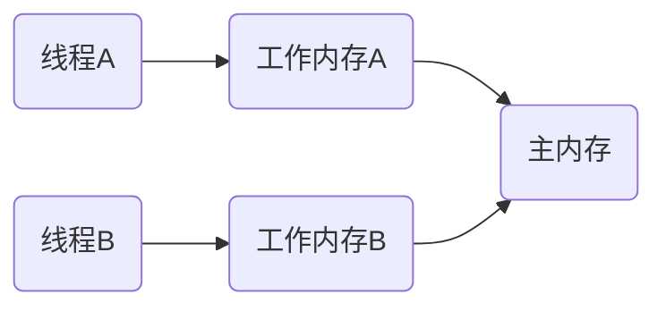
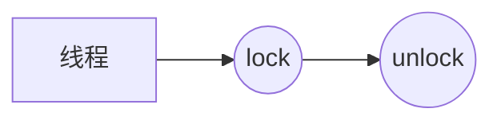
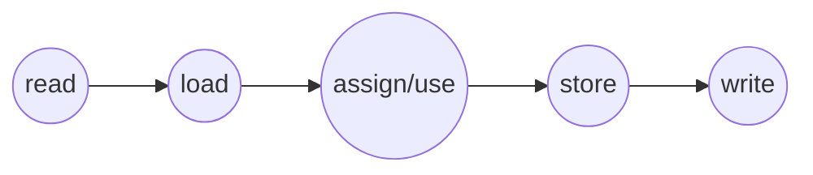
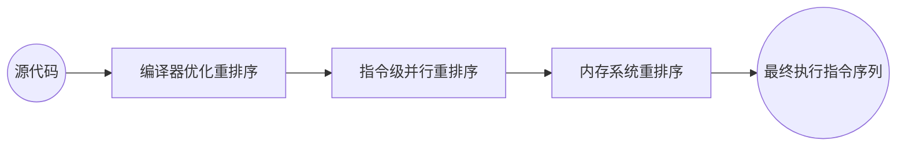
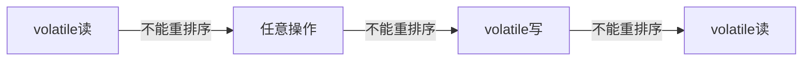
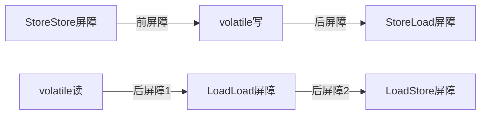
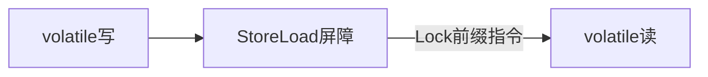
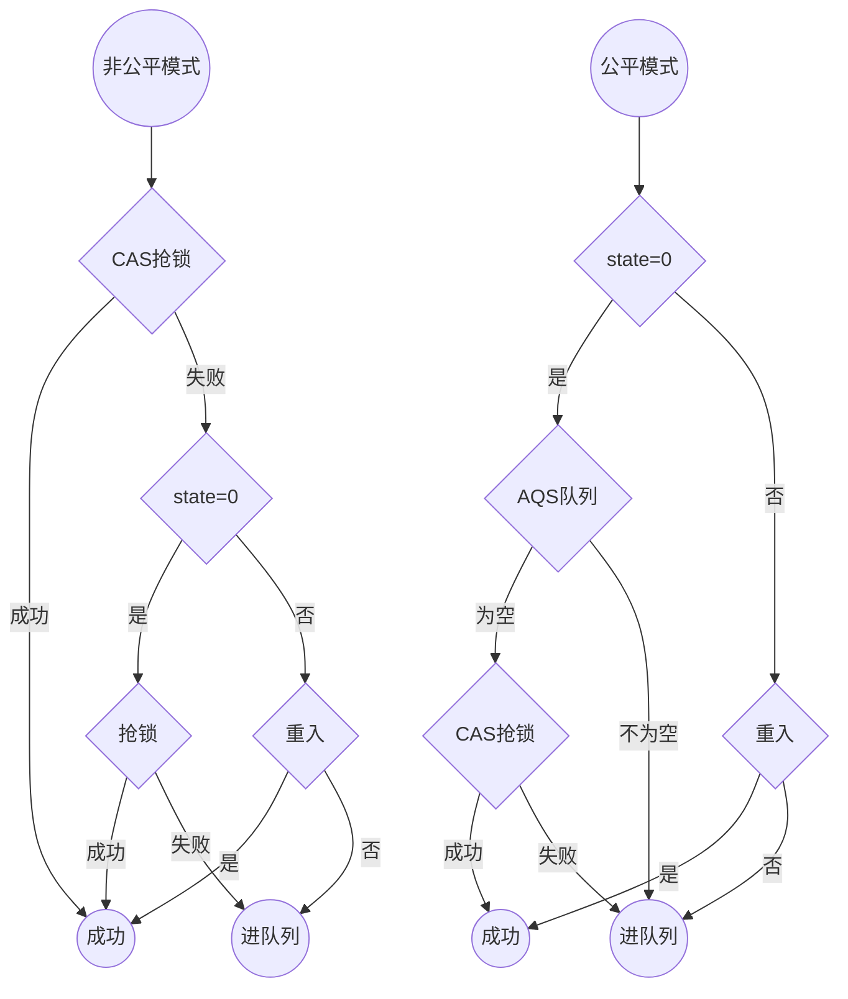
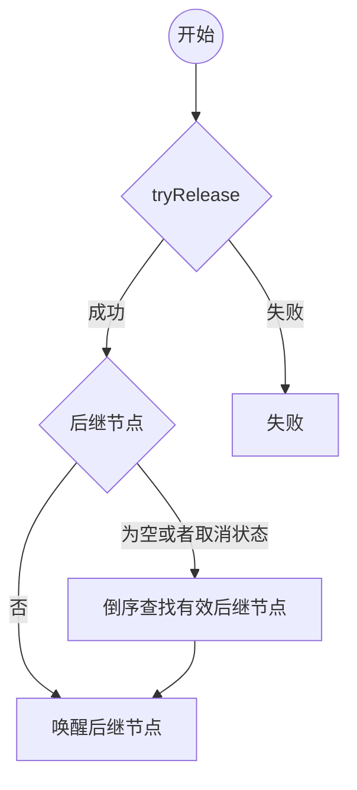
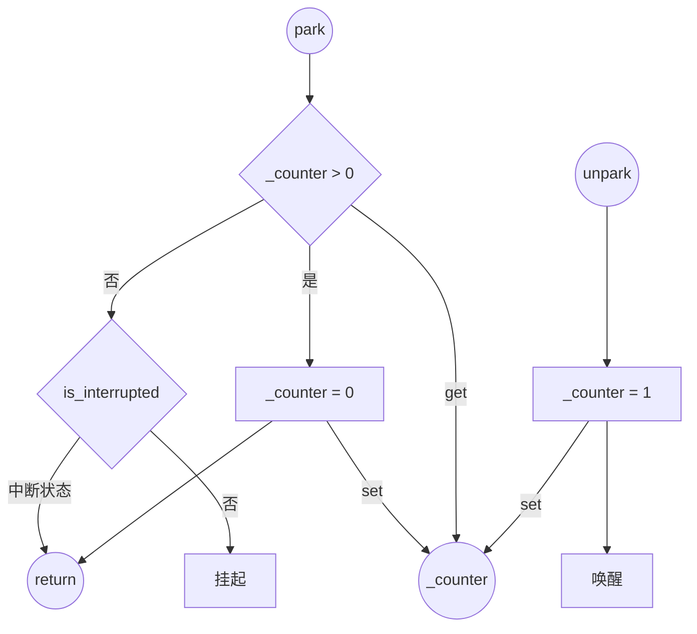

[TOC]

# 基础理论

## 内存模型


- 主内存、工作内存与Java堆、栈、方法区并不是同一个层次的内存划分
- 勉强对应起来
    - 从定义来看，主内存对应Java堆中对象实例数据部分，工作内存对应虚拟机栈中部分区域
    - 从更低层次来说，主内存就是硬件的内存，工作内存对应寄存器和高速缓存

### 内存交互操作

Java内存模型定义了八种内存交互操作
- 主内存操作
    - lock（锁定）：把一个变量标识为线程独占状态
    - unlock（解锁）：把一个处于锁定状态的变量释放出来，释放后的变量才可以被其他线程锁定
    - read（读取）：把主内存变量的值读取到工作内存中，以便随后的load使用
    - write（写入）：把store操作从工作内存中得到的变量值写到主内存的变量中
- 工作内存操作
    - load（载入）：把read操作从主内存中得到的变量值放入工作内存的变量副本中
    - use（使用）：把工作内存中的一个变量值传递给执行引擎，每当虚拟机遇到一个需要使用变量的值的字节码指令时将会执行这个操作
    - assign（赋值）：把一个从执行引擎接收到的值赋值给工作内存的变量，每当虚拟机遇到一个给变量赋值的字节码指令时执行这个操作
    - store（存储）：把工作内存中的一个变量的值传送到主内存中，以便随后的write的操作

### 内存交互规则


- 一个变量同一时刻只允许一个线程对其进行lock操作，但lock操作可以被同一条线程重复执行多次，多次lock之后必须要执行相同次数的unlock操作，变量才会解锁
- 对一个对象进行lock操作，会清空工作内存中变量的值，在执行引擎使用这个变量前，需要重新执行load或assign操作初始化变量的值（保证了变量的可见性）
- 如果一个变量事先没有被lock，就不允许对它进行unlock操作，也不允许去unlock一个被其他线程锁住的变量
- 对一个变量执行unlock操作之前，必须将此变量同步回主内存中（执行store、write）

- 一个新的变量只能在主内存中诞生，不允许在工作内存中直接使用一个未被初始化（load或assign）的变量。即对一个变量实施use和store操作之前，必须先执行过了load和assign操作
- 不允许read和load、store和write操作之一单独出现，即不允许加载或同步工作到一半
- 不允许一个线程丢弃它最近的assign操作，即变量在工作内存中改变了之后，必须同步回主内存
- 不允许一个线程无原因地（无assign操作）把数据从工作内存同步到主内存中

## 三大核心问题

### 可见性

一个线程对共享变量的修改，另外一个线程能够立刻看到，称为可见性

**为什么存在可见性问题？**

由Java的内存模型决定的，工作内存中的变量副本不能及时刷新到主内存中


```java
public class Test {
    public int a = 0;

    public void increase() {
        a++;
    }

    public static void main(String[] args) {
        final Test test = new Test();
        for (int i = 0; i < 10; i++) {
            new Thread() {
                public void run() {
                    for (int j = 0; j < 1000; j++)
                        test.increase();
                };
            }.start();
        }

        while (Thread.activeCount() > 1) {
            // 保证前面的线程都执行完
            Thread.yield();
        }
        System.out.println(test.a);
    }
}
```

**解决方案**

JSR-133内存模型使用happens-before的概念来阐述操作之间的内存可见性。具体参考**happens-before**章节

### 原子性

把一个或者多个操作在 CPU 执行的过程中不被中断的特性称为原子性。反应在Java并发编程中，即一段代码或者一个变量的操作，在一个线程没有执行完之前，不能被其他线程执行

**为什么会有原子性问题？**

多线程场景下，由于时间片在线程间轮换，对于同一个变量的操作，一个线程还没操作完但是时间片耗尽，在等待CPU分配时间片时，其他线程可以获取时间片来操作这个变量，导致多个线程同时操作同一个变量，这就是原子性问题


```java
i = 0;		// 原子性操作
j = i;		// 不是原子性操作，包含了两个操作：读取i，将i值赋值给j
i++; 		// 不是原子性操作，包含了三个操作：读取i值、i + 1 、将+1结果赋值给i
i = j + 1;	// 不是原子性操作，包含了三个操作：读取j值、j + 1 、将+1结果赋值给i

```

**解决方案**

- atomic
- synchronized
- Lock

### 有序性

有序性：程序执行的顺序按照代码的先后顺序执行

**为什么会有有序性问题**

为了提高性能，编译器和处理器经常会对指令进行**重排序**

**解决方案**

参见**重排序**章节

## happens-before

JVM会对代码进行编译优化，指令会出现重排序的情况，为了避免编译优化对并发编程安全性的影响，需要happens-before规则定义一些禁止编译优化的场景，保证并发编程的正确性。

《JSR-133:Java Memory Model and Thread Specification》对happens-before关系的定义如下：
- 如果一个操作happens-before另一个操作，那么第一个操作的执行结果将对第二个操作==可见==，而且第一个操作的执行顺序排在第二个操作之前。
- 两个操作之间存在happens-before关系，并不意味着Java平台的具体实现必须要按照happens-before关系指定的顺序来执行。如果重排序之后的执行结果，与按happens-before关系来执行的结果一致，那么这种重排序并不非法（也就是说，JMM允许这种重排序，遵循as-if-serial语义）

JDK1.5引入Happens-Before原则，只要遵循以下规则就可以达到可见性：

- 程序次序规则（Program Order Rule）：在一个线程内，书写在前面的操作先行发生于后面的操作。准确的说，应该是控制流顺序而不是程序代码顺序，因为要考虑分支和循环等结构。如下代码示例：1 happens-before 2、3 happens-before 4
```java
public class VolatileRule {
    
    private volatile boolean flag = false;
    private int a = 0;

    public void write() {
        a = 1; // 1
        flag = true; //2
    }

    public void read() {
        if (flag) { // 3
            int i = a; // 4
        }
    }
}
```
> 注意：由于遵循as-if-serial语义，如果两者之间不存在数据依赖，编译优化后实际顺序可能会调换位置，这时候前后关系会发生变化。因此，程序次序规则中前后操作应该看编译后实际位置。上述代码，需要实现1 happens-before 2，对flag用volatile进行了修饰，通过在前面加入了StoreStore屏障，禁止2之前的写操作与其进行重排序
>
> 问题：假设线程A执行write()方法，按照volatile会将flag=true写入内存；线程B执行read()方法，按照volatile，线程B会从内存中读取变量a，如果线程B读取到的变量flag为true，那么，此时4中变量a的值是多少呢？？

- volatile 变量规则（Volatile Lock Rule）：对于volatile修饰的变量的写的操作，一定happen-before后续对于volatile变量的读操作。如上次序规则示例中，因为变量flag加了volatile修饰，所以2 happens-before 3

- 传递性规则（Transitivity Rule）：如果A happens-before B，且B happens-before C，那么A happens-before C
> 结合【程序次序规则】、【volatile 变量规则】和【传递性规则】再来看【VolatileRule】程序，可以得出如下结论
> - a = 1 Happens-Before 写变量flag = true，符合【程序次序规则】
> - 写变量程序次序规则flag = true Happens-Before 读变量程序次序规则flag = true，符合【volatile 变量规则】
> - 再根据【传递性规则】，可以得出结论：a = 1 Happens-Before 读变量flag=true 
>
> 也就是说，如果线程B读取到了flag=true，那么，线程A设置的a=1对线程B就是可见的，即线程B能够访问到a=1

- 监视器锁定规则（Monitor Lock Rule）：一个unlock操作先行发生于后面对同一个锁的lock操作。这里必须强调的是必须为同一个锁，而“后面”是指的时间上的先后顺序。如下示例，假如线程A先进去执行过一次a++，然后释放锁，然后线程B再进入同步代码块，那么B获得的x为1
```java
public class LockRule {
    private static int a = 0;

    public void increase() {
        synchronized (this) { // 两个线程同时访问，相互修改的值均对对方可见
            a++;
        }
        System.out.println(a);
    }
}
```

- 线程启动规则（Thread Start Rule）：Thread对象的start()方法，先行发生行于此线程的每一个动作。如下示例中，因为1 happens-before 2，而2又happens-before线程1内的所有操作，所以a的值对线程t1是可见的

```java
public class StartRule {
    
    private static volatile int a = 0;

    public static void main(String[] args) {
        Thread t1 = new Thread(() -> {
            // 主线程修改的值对t1可见
            System.out.println(a);
        });
        a = 10; // 1
        t1.start(); // 2
    }
}
```
> 

- 线程中断规则（Thread Interruption Rule）：对线程interrupt()方法的调用，先行发生于检测到中断事件的发生，我们可以通过Thread.interrupted()、Thread.currentThread().isInterrupted()方法检测到是否有中断发生，区别在于前者会清除中断标识
```java
public class InterruptRule {

    public void increase() {
        Thread t = new Thread(() -> {
            while (!Thread.currentThread().isInterrupted()) { // 检测线程是否中断
                System.out.println("逻辑处理完成");
                try {
                    Thread.sleep(100); 
                } catch (InterruptedException e) {
                    System.out.println("没有按照预期正常结束");
                    Thread.currentThread().interrupt();  
                    // sleep()、wait()等中断异常抛出之前会清除线程中断标识，因此需要手动再次中断while循环才可以检测到中断状态
                }
            }
        });
        t.start();
        Thread.sleep(1000);
        t.interrupt();
    }
}
```

- 线程终结规则（Thread Termination Rule）：线程中所有操作happens-before于对此线程的终止检测，我们可以通过Thread.join()等手段检测到线程已经终止。如下示例中，因为1 happens-before 2，而2又happens-before 3，所有t1中修改了a的值，对主线程可见

```java
public class JoinRule {
    private static int a = 0;

    public static void main(String[] args) throws InterruptedException {
        Thread t1 = new Thread(() -> {
            a = 100; // 1
        });
        a = 10;
        t1.start();
        t1.join(); // 2 当前线程对t1加锁，并调用wait，造成当前线程堵塞
        System.out.println(a); // 3 x=100
    }
}
```

- 对象终结规则（Finalizer Rule）：一个对象的初始化完成(构造函数执行结束)先行发生于它的finalize()方法


## 重排序

### 重排序概念及问题


为了提高性能，编译器和处理器经常会对指令进行重排序，分成三种类型
- 编译器优化重排序：编译器在不改变单线程程序语义的前提下，可以重新安排语句的执行顺序
- 指令级并行重排序：现代处理器采用了指令级并行技术来将多条指令重叠执行。如果不存在数据依赖性，处理器可以改变语句对应机器指令的执行顺序
- 内存系统的重排序：由于处理器使用缓存和读写缓冲区，这使得加载和存储操作看上去可能是在乱序执行

例如

```java
int a=1;
int b=2;
```
编译器优化后可能如下
```java
int b=2;
int a=1;
```
在这个例子中，重排序不影响程序的最终结果，但有时候可能导致意想不到的Bug，如：经典的双检锁创建单例
```java
public class Singleton {
  
  private static Singleton instance;
  
  public static Singleton getInstance(){
    if (instance == null) {
      synchronized(Singleton.class) {
        if (instance == null)
          instance = new Singleton();
        }
    }
    return instance;
  }
}
```
多线程的情况下可能触发空指针异常，分析如下：
```java
instance = new Singleton(); 创建对象的代码，可分解为三步：
1. 分配内存空间
2. 初始化对象Singleton
3. 将内存空间的地址赋值给instance

但是这三步经过重排之后可能为：
1、分配内存空间
2、将内存空间的地址赋值给instance
3、初始化对象Singleton

当线程A执行完第2步时，线程切换到线程B执行，第一次判断会发现instance!=null，直接返回instance。由于instance未初始化，访问其成员变量或方法可能触发空指针异常
```

### 重排序规则


- 重排序遵守as-if-serial 语义：不管怎么重排序（编译器和处理器为了提高并行度），（单线程）程序的执行结果不能被改变
- 同一个线程中，存在数据依赖关系的两个操作，不可以重排序（实际上和as-if-serial一回事，一种具体的阐述）
```java
// 写后读：写一个变量之后，再读这个位置
int a = 1;
int b = a; 

// 写后写：写一个变量之后，再写这个变量
int a = 1;
int a = 2;

// 读后写：读一个变量之后，再写这个变量
int a = b;
int b = 1;
```

### JMM解决方案

- 对于编译器，JMM(Java内存模型)的编译器重排序规则会禁止特定类型的编译器重排序（happens-before）
- 对于处理器重排序，JMM的处理器重排序规则会要求Java编译器在生成指令序列时，插入特定类型的**内存屏障**指令，来禁止特定类型的处理器重排序
- JMM根据代码中的关键字（如：synchronized、volatile）和J.U.C(java.util.concurrent)包下的一些具体类来插入内存屏障

## 内存屏障

为了保证的有序性，Java编译器在生成指令序列的适当位置会插入内存屏障指令来禁止特定类型的处理器重排序，如下：

| 屏障类型   | 指令示例                 | 说明                                                         |
| ---------- | ------------------------ | ------------------------------------------------------------ |
| LoadLoad   | Load1 LoadLoad Load2     | 确保Load1数据的装载，之前于Load2及所有后续装载指令的装载     |
| StoreStore | Store1 StoreStore Store2 | 确保Store1的数据可见(刷新到内存)，之前于Store2及所有后续存储指令的存储 |
| LoadStore  | Load1 LoadStore Store2   | 确保Load1数据的装载，之前于Store2及所有后续存储指令刷新到内存 |
| StoreLoad  | Store1 StoreLoad Load2   | 确保Store1数据对其他处理器变得可见，之前于Load2及所有后续装载指令的装载 |

> store：数据对其他处理器可见，即刷新到内存中
>
> load：让缓存中的数据失效，重新从主内存加载数据

## CAS

Compare And Swap，即比较并交换，比较交换的过程 CAS(V,A,B)：
- V-一个内存地址存放的实际值、A-旧的预期值、B-即将更新的值
- 当且仅当预期值 A 和内存值 V 相同时，将内存值修改为 B 并返回 true，否则什么都不做，并返回 false
- CAS的核心类是Unsafe，根据内存偏移地址获取数据的原值，通过lock前缀指令确保比较替换操作的原子性（缓存加锁，只保证在同一时刻对某个内存地址的操作是原子性的即可）
- 在 java 1.5 后的 atomic 包中提供了 AtomicStampedReference 来解决 ABA 问题

## Unsafe

Unsafe类使Java拥有了像C语言的指针一样操作内存空间的能力，一旦能够直接操作内存，这也就意味着
- 不受jvm管理，也就意味着无法被GC，需要我们手动GC，稍有不慎就会出现内存泄漏
- Unsafe的不少方法中必须提供原始地址(内存地址)和被替换对象的地址，偏移量要自己计算，一旦出现问题就是JVM崩溃级别的异常，会导致整个JVM实例崩溃，表现为应用程序直接crash掉
- 直接操作内存，也意味着其速度更快，在高并发的条件之下能够很好地提高效率

方法归类：
- 初始化操作
    - 通过getUnsafe方法实现的单例模式 
    - 只能通过类加载器BootStrap classLoader加载，否则抛出SecurityException
- 操作对象属性
- 操作数组元素
- 内存管理
- 线程挂起和恢复
- 内存屏障
- CAS机制

参考：[Unsafe类详解](https://baijiahao.baidu.com/s?id=1648712942552745701&wfr=spider&for=pc)

# 并发关键字

## volatile

### 保证可见性

- 一个线程修改volatile变量的值时，该变量的新值会立即刷新到主内存中，这个新值对其他线程来说是立即可见的
- 一个线程读取volatile变量的值时，该变量在本地内存中缓存无效，需要到主内存中读取

```java
boolean stop = false;// 是否中断线程1标志
//Tread1
new Thread() {
    public void run() {
        while(!stop) {
          doSomething();
        }
    };
}.start();
//Tread2
new Thread() {
    public void run() {
        stop = true;
    };
}.start();
```
### 保证有序性


> volatile写实际上是在前面加了一个StoreStore屏障，要求不能和前面的写操作进行重排序。读操作没有要求，只是因为volatile读后面加了LoadStore屏障，因此也不能和前面的volatile读重排序。至于普通读，应该是可以进行重排的，猜测是由于读取对数据本身不产生影响，多线程情况下不存在安全问题（很多资料中都写的是前面任意操作都不能进行重排序）

```java
boolean inited = false;// 初始化完成标志
//线程1:初始化完成，设置inited=true
new Thread() {
    public void run() {
        context = loadContext();   // 语句1
        inited = true;             // 语句2
    };
}.start();
//线程2:每隔1s检查是否完成初始化，初始化完成之后执行doSomething方法
new Thread() {
    public void run() {
        while(!inited){ // 语句3
          Thread.sleep(1000);
        }
        doSomething(context);
    };
}.start();
```
> 线程1中，语句1和语句2之间不存在数据依赖关系，JMM允许这种重排序。如果在程序执行过程中发生重排序，先执行语句2后执行语句1，会发生什么情况？
>
> 当线程1先执行语句2时，配置并未加载，而inited=true设置初始化完成了。线程2执行时，读取到inited=true，直接执行doSomething方法，而此时配置未加载，程序执行就会有问题

### 不保证原子性

volatile是不能保证原子性的，可使用原子类或者加锁


### volatile实现原理

- 有序性原理



- 可见性原理

> Lock前缀的指令将该变量所在缓存行的数据写回到主内存中，并使其他处理器中缓存了该变量内存地址的数据失效
>
> 当其他线程读取volatile修饰的变量时，本地内存中的缓存失效，就会到到主内存中读取最新的数据

- 总线风暴
> 基于 CPU 缓存一致性协议，JVM 实现了 volatile 的可见性。但由于总线嗅探机制，会不断的监听总线。如果大量使用 volatile，cas不断循环无效交互会导致总线带宽达到峰值，引起总线风暴。

### 伪共享问题

```java
public class Share {
   volatile int value;
}
```

volatile修饰解决了value内存可见性问题，但由于线程本地缓存是以缓存行为单位，可能会存储其他变量。因此，volatile带来的缓存失效会使同一缓存行上的其他变量也失效，访问时也需要从主从中再次获取，带来性能问题，此类问题称之为伪共享。

**如何解决呢？**

保证一个缓存行上只有一个share变量即可。早期版本JDK有使用无用变量作为填充物解决的，但是存在不同机器缓存行大小不一致、无用填充物被JVM优化掉等问题。基于此，在Java 8官方提供了Contended 注解，如下：

```java

public class Share {
    @Contended
    volatile int value;
}
```

使用如上注解，需要在 JVM 启动参数中加入 **-XX:-RestrictContended**，这样 JVM 在运行时就会自动的为我们的 Share 类添加合适大小的填充物（padding）来解决伪共享问题。

## final

### 基本特性

- final变量只能被赋值一次，赋值后值不再改变（引用对象地址值不能改变，但内容可以变化）
- final修饰的方法在编译阶段被静态绑定(static binding)，不能被重写
- final修饰的类不能被继承，所有成员方法都会被隐式地指定为final方法

### 并发final


> final变量赋值必须在所属对象引用获取前完成，通过在final写后面插入StoreStore屏障，禁止处理器把final域的写重排序到构造函数之外

> 相反，final变量读取必须在所属对象引用获取后完成，通过在final读前面插入LoadLoad屏障，禁止读对象引用和读该对象final域重排序

```java
public class FinalDemo {
    private int a;  // 普通域
    private final int b; // final域
    private static FinalDemo finalDemo;

    public FinalDemo() {
        a = 1; // ①写普通域
        b = 2; // ②写final域
    }

    // 线程A先执行writer()方法
    public static void writer() {
		 // 两个操作：
		 // 1）构造一个FinalExample类型的对象，①写普通域a=1，②写final域b=2
		 // 2）③把这个对象的引用赋值给引用变量finalDemo
        finalDemo = new FinalDemo();
    }

    // 线程B后执行reader()方法
    public static void reader() {
        FinalDemo demo = finalDemo; // ④读对象引用
        int a = demo.a;    // ⑤读普通域
        int b = demo.b;    // ⑥读final域
    }
}
```
> 若示例中final int a变为引用类型final int[] arrays，在构造函数中初始化数组并赋值，赋值语句同样不会重排序到构造函数以外

# 锁

## 锁分类

- 悲观锁与乐观锁
    - 悲观锁认为对于同一个数据的并发操作，一定是会发生修改的，哪怕没有修改，也会认为修改。因此对于同一个数据的并发操作，悲观锁采取加锁的形式。悲观的认为，不加锁的并发操作一定会出问题
    - 乐观锁则认为对于同一个数据的并发操作，有可能不会发生修改的。在更新数据的时候，会采用尝试更新，不加锁的方式更新数据。乐观的认为，不加锁的并发操作是没有事情的
- 可重入锁：又名递归锁，是指在同一个线程在外层方法获取锁的时候，在进入内层方法会自动获取锁，可一定程度避免死锁
- 共享锁与独占锁
    - 独享锁是指该锁一次只能被一个线程所持有
    - 共享锁是指该锁可被多个线程所持有
- 互斥锁与读写锁：独享锁/共享锁的具体实现
- 公平锁与非公平锁
    - 公平锁是指多个线程按照申请锁的顺序来获取锁
    - 非公平锁是指多个线程获取锁的顺序并不是按照申请锁的顺序，有可能后申请的线程比先申请的线程优先获取锁，可能会造成优先级反转或者饥饿现象
- 分段锁：一种锁的设计，并不是具体的一种锁，对于ConcurrentHashMap而言，其并发的实现就是通过分段锁的形式来实现高效的并发操作
- 偏向锁/轻量级锁/重量级锁
- 自旋锁：当锁被占用时，当前想要获取锁的线程不会被立即挂起，而是做几个空循环，看持有锁的线程是否会很快释放锁。默认次数为10次，可以通过参数-XX:PreBlockSpin来调整
- 自适应自旋锁：自旋的次数不再是固定的，它是由前一次在同一个锁上的自旋时间及锁的拥有者的状态来决定

## Java中锁实现

### synchronized

#### 原理探究

synchronized加锁的四种方式
```java
public class SynchronizedTest {

    // 静态方法上加synchronized关键字，锁是当前类的class对象
    public static synchronized void sync1() {

    }

    // 普通方法上加synchronized关键字，锁是当前实例对象，与sync1仅作用域不同
    public synchronized void sync2() {

    }

    // synchronized代码块，锁是括号里面的对象
    public void sync3() {
        synchronized (this) {

        }
    }

    // synchronized代码块，class上加锁，与sync3仅作用域不同
    public void sync4() {
        synchronized (SynchronizedTest.class) {

        }
    }
}
```

> 查看汇编代码，执行javac -encoding UTF-8 SynchronizedTest.java、javap -v SynchronizedTest.class

```java
  public static synchronized void sync1();
    descriptor: ()V
    flags: ACC_PUBLIC, ACC_STATIC, ACC_SYNCHRONIZED // ACC_STATIC, ACC_SYNCHRONIZED
    Code:
      stack=0, locals=0, args_size=0
         0: return
      LineNumberTable:
        line 19: 0

  public synchronized void sync2();
    descriptor: ()V
    flags: ACC_PUBLIC, ACC_SYNCHRONIZED // ACC_SYNCHRONIZED
    Code:
      stack=0, locals=1, args_size=1
         0: return
      LineNumberTable:
        line 23: 0

  public void sync3();
    descriptor: ()V
    flags: ACC_PUBLIC
    Code:
      stack=2, locals=3, args_size=1
         0: aload_0 // 将第一个引用类型本地变量推送至栈顶
         1: dup // 复制栈顶一个字长的数据，将复制后的数据压栈
         2: astore_1
         3: monitorenter // 加锁
         4: aload_1
         5: monitorexit // 释放锁
         6: goto          14
         9: astore_2
        10: aload_1
        11: monitorexit
        12: aload_2
        13: athrow
        14: return

  public void sync4();
    descriptor: ()V
    flags: ACC_PUBLIC
    Code:
      stack=2, locals=3, args_size=1
         // ldc将常量池中#2推送至栈顶，即class com/SynchronizedTest
         0: ldc           #2                  // class com/SynchronizedTest
         2: dup
         3: astore_1
         4: monitorenter // 加锁
         5: aload_1
         6: monitorexit // 释放锁
         7: goto          15
        10: astore_2
        11: aload_1
        12: monitorexit // 释放锁
        13: aload_2
        14: athrow
        15: return
```
[java 指令集](https://blog.csdn.net/hejinjing_tom_com/article/details/8723228)

> 1. 对于同步方法
> - JVM采用ACC_SYNCHRONIZED标记符来实现同步。当某个线程要访问某个方法的时候，会检查是否有ACC_SYNCHRONIZED，如果有设置，则需要先获得监视器锁（monitor），然后开始执行方法，方法执行之后再释放监视器锁。这时如果其他线程来请求执行方法，会因为无法获得监视器锁而被堵塞。
> - 同步方法是隐式的，会在运行时常量池中的method_info结构体中存放ACC_SYNCHRONIZED标识符access_flags
>
> 2. 对于同步代码块，JVM采用monitorenter、monitorexit两个指令来实现同步

#### Monitor

无论是同步方法还是同步代码块都是基于监视器Monitor实现

在Java虚拟机(HotSpot)中，monitor是由ObjectMonitor实现的（位于HotSpot虚拟机源码ObjectMonitor.hpp文件，C++实现的）

ObjectMonitor中有几个关键属性：
- _owner：指向持有ObjectMonitor对象的线程
- _WaitSet：存放处于wait状态的线程队列
- _EntryList：存放处于等待锁block状态的线程队列
- _recursions：锁的重入次数
- _count：用来记录该线程获取锁的次数

ObjectMonitor中有几个关键方法：
- enter(TRAPS)
- exit(TRAPS)
- wait(jlong millis, bool interruptable, TRAPS)
- nofity(TRAPS)
- notifyAll(TRAPS)


#### 解决三大问题

- 保证原子性：同一时间只能被一个线程访问，在锁未释放之前，无法被其他线程访问到
- 保证有序性：单线程重排序要遵守as-if-serial语义，而synchronized修饰的代码，同一时间只能被同一线程访问
- 保证可见性
    - 线程解锁前，必须把共享变量的最新值刷新到主内存中
    - 线程加锁前，将清空工作内存中共享变量的值，从而使用共享变量时需要从主内存中重新读取最新的值

#### synchronized锁优化

Java的线程是映射到操作系统原生线程之上的，如果要阻塞或唤醒一个线程就需要操作系统的帮忙，这就要从用户态转换到内核态，状态转换需要花费很多的处理器时间。

##### Java对象头


> 1. Klass Word（类指针）：存储对象的类型指针，该指针指向它的类元数据。从JDK 1.6 update14开始，64位的JVM正式支持了-XX:+UseCompressedOops（默认开启），可以压缩指针，起到节约内存占用的作用。oop(ordinary object pointer)即普通对象指针，下列指针将压缩至32位：
> - 每个Class的属性指针（静态成员变量）
> - 每个对象的属性指针（对象变量）
> - 普通对象数组的每个元素指针
> 2. 指针压缩：
> - 如果GC堆大小在4G以下，直接砍掉高32位，避免了编码解码过程(偏移量除以/乘以8)
> - 如果GC堆大小在4G以上32G以下，则启用-XX:+UseCompressedOops命令
> - 如果GC堆大小大于32G，压指失效，使用原来的64位
> 3. -XX:+UseCompressedClassPointers
> - Java8使用Metaspace存储元数据，开启后类元信息中的指针也用32bit的Compressed版本，即Klass Word
> - 依赖-XX:+UseCompressedOops
> 4. 数组长度64位JVM的情况下也被压缩至32位
> 5. 对齐字节：HotSpot VM的自动内存管理要求对象大小必须是8字节的整数倍，不足时需要对齐填充来补全


> 1. 32位虚拟机占用32个字节，不同状态下各个比特位区间大小有变化
> 2. biased_lock：偏向锁标记，为1时表示对象启用偏向锁
> 3. age：默认情况下，并行GC的年龄阈值为15，并发GC的年龄阈值为6。由于age只有4位，所以最大值为15
> 4. identity_hashcode
> - 采用延迟加载技术，只有在需要时使用System.identityHashCode(Object x)计算后写到该对象头中
> - 偏向锁没有存储HashCode的地方，偏向锁期间调用System.identityHashCode(x)会造成锁升级
> - 轻量级锁和重量级锁所指向的lock record或monitor都有存储HashCode的空间
> - 用户自定义hashCode()方法所返回的值不存在Mark Word中，只针对identity hash code
> 5. thread：持有偏向锁的线程ID
> 6. epoch：偏向锁的时间戳
> 7. ptr_to_lock_record：轻量级锁状态下，指向栈中锁记录的指针
> 8. ptr_to_heavyweight_monitor：重量级锁状态下，指向对象监视器Monitor的指针

```java
// 引入依赖
<dependency>
    <groupId>org.openjdk.jol</groupId>
    <artifactId>jol-core</artifactId>
    <version>0.11</version>
</dependency>
        
// 查看对象布局信息        
ClassLayout layout = ClassLayout.parseInstance(new A());
System.out.println(layout.toPrintable());
```
> 可通过ClassLayout查看对象布局信息，即对象占用空间情况

##### 锁升级机制


> 锁升级是单向的: 无锁 -> 偏向锁 -> 轻量级锁（自旋锁和自适应自旋锁） -> 重量级锁
>
> 持有偏向锁的线程不会主动释放偏向锁，而是等待其他线程来竞争才会释放锁。这样偏向锁保证了总是同一个线程多次获取锁的情况下，每次只需要检查标志位就行，效率很高
>
> 当检测到偏向锁且不归属当前线程，会暂停原持有偏向锁线程，检测其执行状态：
> - 如果偏向锁线程已退出同步代码块，清除偏向锁标识，转为无锁状态，由当前线程获取轻量级锁
> - 如果偏向锁线程未退出同步代码块，由其膨胀为轻量级锁

##### 锁消除

JIT编译器借助逃逸分析（Escape Analysis）技术来判断同步块所使用的锁对象是否只能够被一个线程访问，如果被证实，就会取消对这部分代码的同步

```java
public class EscapeAnalysis {

    public static Object object;

    public Object methodEscape1() {  // 方法逃逸：方法返回值逃逸
        return new Object();
    }

    public Object methodEscape2() {  // 方法逃逸：作为参数传递到其它方法中
        Object object=new Object();
        xxx(object)
    }

    public void threadEscape1() {// 线程逃逸：赋值给类变量
        object = new Object();
    }
    
    public void threadEscape2() { // 线程逃逸：其他线程中访问的实例变量
        Object obj=new Object();
        new Thread(() -> xxx(obj)).start();
    }
    
    public void eliminate1() { // o未逃逸，可自动清除锁
        Object o=new Object();
        synchronized (o){
            xxx();
        }
    }
 
    public void eliminate2() { // buffer未逃逸，append操作加锁可自动清除锁
        StringBuffer buffer=new StringBuffer();
        buffer.append("hello");
        buffer.append("world");
        buffer.append("!");
    }
}
```
> 1. 逃逸分析缺点：不能保证逃逸分析的性能收益必定高于它的消耗
> 2. 逃逸分析还可以用于：
> - 标量替换：把不存在逃逸的对象拆散，将成员变量恢复到基本类型，直接在栈上创建若干个成员变量
> - 栈上分配：目前Hotspot并没有实现真正意义上的栈上分配，实际上是标量替换。栈上分配随着方法结束而自动销毁，垃圾回收压力减小

##### 锁粗化

尽量减小锁的粒度，可以避免不必要的阻塞。但是如果在一段代码中连续的用同一个监视器锁反复的加锁解锁，甚至加锁操作出现在循环体中的时候，就会导致不必要的性能损耗，这种情况就需要锁粗化。

```java
for(int i=0;i<100000;i++){
    synchronized(this){
        do();
}
```
会被粗化成：
```java
synchronized(this){
    for(int i=0;i<100000;i++){
        do();
}
```

### 显式锁Lock

#### 特性

| 特性             | API                          |
| ---------------- | ---------------------------- |
| 能响应中断       | lockInterruptbly()           |
| 非阻塞式的获取锁 | tryLock()                    |
| 支持超时         | tryLock(long time, timeUnit) |
| 可实现公平锁     | ReentrantLock(ture)          |
| 可以绑定多个条件 | newCondition()               |

#### 使用范式

```java
Lock lock = new ReentrantLock();
lock.lock();
try{
	...
}finally{
	lock.unlock();
}
```

#### 原理分析

基于AbstractQueuedSynchronizer，队列同步器实现

##### 好处


##### 可重写方法


##### 同步状态获取/修改

> setState()：拥有锁的线程调用本身具有原子性，不需要使用cas进行设置

##### 同步状态获取流程图

> 1. 右下方【线程进入等待状态】的流程图中“结束”不是真正意思上的结束，外层是一个死循环。只有前驱节点为头结点，且获取同步状态成功才会退出循环。节点的就绪、挂起、获取同步都是在循环里完成的，很重要！！！
> 2. 响应中断获取同步状态只是在中断检测的处理方式上不同，Thread.interrupted()检测到中断状态后直接抛出了InterruptedException
> - LockSupport.park()，线程挂起
> - 调用Thread的interrupt方法，设置中断标识为true，且内部会调用Parker::unpark()，唤醒挂起线程
> - 调用Thread.interrupted()返回并清除中断标识
> - 中断状态为true抛出异常
>
> 3. 超时限制获取同步状态在循环中计算超时时间，超时中断循环，并且线程挂起使用的是限时挂起LockSupport.parkNanos，1000 nanoseconds内自旋不挂起，时间较短，没有必要挂起和唤醒)

##### 公平和非公平模式下的区别


##### 同步状态释放


> - tryRelease：getState() - releases是否等于0，即释放后state==0
> - 后继节点：头结点的后继节点，修改head的waitStatus=0并唤醒后继节点(head的waitStatus=0不执行唤醒后继节点)。非公平模式下，被唤醒的后继节点有可能抢锁失败，会再次把head的waitStatus修改为-1，自旋再次抢锁，若再失败线程挂起，等待下次唤醒
> - 倒序查找有效后继节点
>   - 节点加入双向队列时，双向链表的建立非原子操作，先建立的是Prev指针（正常查找可能找不到该节点）
>   - 取消节点时，先断开的是Next指针，Prev指针并未断开（查找可能中断）

##### 同步队列与等待队列


##### ReentrantReadWriteLock

> - 支持写锁降级，不支持读锁升级
> - 非公平读锁下为了避免写锁饥饿，会判断头节点的下一个节点是否为排他节点(即写请求)，如果是，当前的读锁堵塞
> - 每个线程持有读锁的次数，使用ThreadLocal记录
> - 使用写锁时需要先释放读锁，如果有两个读取锁试图获取写入锁，且都不释放读取锁时，就会发生死锁。因为写锁是排它锁，两个线程都会因为有其他线程持有读锁而无法获取写锁
> - 读锁不支持Condition(读锁在某一时刻最多可以被多个线程拥有，对于读锁而言，其他线程没有必要等待获取读锁，等待唤醒是毫无意义的)

##### StampedLock

JDK 8新增的读写锁StampedLock，跟读写锁ReentrantReadWriteLock不同，它并不是由AQS实现，有三种访问模式：
- 写锁writeLock：功能和读写锁的写锁类似
- 悲观读锁readLock：功能和读写锁的读锁类似
- 乐观读锁Optimistic reading：一种优化的读模式，解决读锁和写锁互斥问题

StampedLock可以将三种模式是锁进行有条件的互相转换
- tryConvertToWriteLock()：将其他锁转换为写锁
    - 当前邮戳为持有写锁模式，直接返回当前的邮戳；
    - 当前邮戳为持有读锁模式，则会释放读锁并获取写锁，并返回写锁邮戳；
    - 当前邮戳持有乐观锁，通过CAS立即获取写锁，成功则返回写锁邮戳；失败则返回0；
- tryConvertToReadLock：将其他锁转换为读锁
    - 当前邮戳为持有写锁模式，则会释放写锁并获取读锁，并返回读锁邮戳；
    - 当前邮戳为持有读锁模式，则直接返回当前读锁邮戳；
    - 当前邮戳持有乐观锁，通过CAS立即获取读锁，则返回读锁邮戳；否则，获取失败返回0；
- tryConvertToOptimisticRead：将其他锁转换为乐观锁
    - 当前邮戳为持有读或写锁，则直接释放读写锁，并返回释放后的观察者邮戳值；
    - 当前邮戳持有乐观锁，若乐观锁邮戳有效，则返回观察者邮戳；

Oracle 官方的例子：
```java
class Point {
    private double x, y;// 成员变量
    private final StampedLock sl = new StampedLock();// 锁实例

    /**
     * 写锁writeLock
     * 添加增量，改变当前point坐标的位置。
     * 先获取到了写锁，然后对point坐标进行修改，然后释放锁。
     * 写锁writeLock是排它锁，保证了其他线程调用move函数时候会被阻塞，直到当前线程显示释放了该锁，也就是保证了对变量x,y操作的原子性。
     */
    void move(double deltaX, double deltaY) {
        long stamp = sl.writeLock();
        try {
            x += deltaX;
            y += deltaY;
        } finally {
            sl.unlockWrite(stamp);
        }
    }

    /**
     * 乐观读锁tryOptimisticRead
     * 计算当前位置到原点的距离
     */
    double distanceFromOrigin() {
        long stamp = sl.tryOptimisticRead();    // 尝试获取乐观读锁(1)
        double currentX = x, currentY = y;      // 将全部变量拷贝到方法体栈内(2)

        // 检查票据是否可用，即写锁有没有被占用(3)
        if (!sl.validate(stamp)) {
            // 如果写锁被抢占，即数据进行了写操作，则重新获取
            stamp = sl.readLock();// 获取悲观读锁(4)
            try {
                // 将全部变量拷贝到方法体栈内(5)
                currentX = x;
                currentY = y;
            } finally {
                sl.unlockRead(stamp);// 释放悲观读锁(6)
            }
        }

        return Math.sqrt(currentX * currentX + currentY * currentY);// 真正读取操作，返回计算结果(7)
    }

    /**
     * 悲观读锁readLock
     * 如果当前坐标为原点则移动到指定的位置
     */
    void moveIfAtOrigin(double newX, double newY) {
        long stamp = sl.readLock();// 获取悲观读锁(1)
        try {
            // 如果当前点在原点则移动(2)
            while (x == 0.0 && y == 0.0) {
                long ws = sl.tryConvertToWriteLock(stamp);// 尝试将获取的读锁升级为写锁(3)

                if (ws != 0L) {
                    // 升级成功，则更新票据，并设置坐标值，然后退出循环(4)
                    stamp = ws;
                    x = newX;
                    y = newY;
                    break;
                } else {
                    // 读锁升级写锁失败，则释放读锁，显示获取独占写锁，然后循环重试(5)
                    sl.unlockRead(stamp);
                    stamp = sl.writeLock();
                }
            }
        } finally {
            sl.unlock(stamp);// 释放写锁(6)
        }
    }
}
```


> 参考：
> - https://www.cnblogs.com/FraserYu/archive/2020/06/03/13035284.html
> - https://www.cnblogs.com/FraserYu/p/13185709.html

# 多线程

## 线程

### 进程/线程/协程/管程

- 进程：操作系统会以进程为单位，分配系统资源（CPU时间片、内存等资源），是资源分配的最小单位


> 进程间通信（IPC）：
> - 管道(Pipe)
> - 命名管道(FIFO)
> - 消息队列(Message Queue) 
> - 信号量(Semaphore) 
> - 共享内存（Shared Memory）
> - 套接字（Socket）

- 线程：也被称为轻量级进程(Lightweight Process，LWP），是操作系统调度（CPU调度）执行的最小单位

> - 线程作为调度和分配的基本单位，进程作为拥有资源的基本单位
> - 一个线程只能属于一个进程，而一个进程可以有多个线程，但至少有一个线程
> - 资源分配给进程，同一进程的所有线程共享该进程的所有资源
> - 多进程的程序要比多线程的程序健壮(进程崩溃不影响其它进程)，但在进程切换时，耗费资源较大，效率要差一些
> - 进程/线程之间的亲缘性决定了同一个进程/线程只在某个cpu上运行，避免因切换带来的CPU的L1/L2 cache失效而造成性能损失

- 协程/协程/微线程：一种比线程更加轻量级的存在，不被操作系统内核所管理，而完全是由程序所控制（也就是在用户态执行）
> - 极高的执行效率：因为子程序切换不是线程切换，而是由程序自身控制，因此，没有线程切换的开销，和多线程比，线程数量越多，协程的性能优势就越明显；
> - 不需要多线程的锁机制：因为只有一个线程，也不存在同时写变量冲突，在协程中控制共享资源不加锁，只需要判断状态就好了，所以执行效率比多线程高很多
> - 资源占用小，初始一般为2KB，而线程java中默认1M
> - java原生不支持，可以关注quasar，适合I/O密集型操作
> - 参考：[Java里的协程](https://blog.csdn.net/qiansg123/article/details/80123051)

- 管程 (英语：Monitors，也称为监视器)：用来管理共享变量以及对共享变量操作的过程，它解决了并发编程中的两大核心问题：互斥与同步。翻译为Java领域的语言，就是管理类的成员变量和成员方法，让这个类是线程安全的


> - 如上图的管程模型图中，方框代表管程对共享变量以及操作共享变量方法的封装，在入口处有一个等待队列，当有多个线程试图进入管程时，管程只允许一个线程进入，其他的线程进入到等待队列中
> - 在管程中引入了条件变量的概念，每个条件变量都对应一个等待队列。如图中的条件变量A和B分别对应一个等待队列
> - synchronized的底层实现就是通过管程实现，不过只支持一个条件变量
> - Lock和Condition也是通过管程模型来实现锁的。其中Lock用来实现互斥的，Condition用来实现同步的，支持多条件变量


### 并行/并发

- 并发(Concurrent)：当多个线程在操作时，如果系统只有一个CPU，则它根本不可能真正同时进行一个以上的线程，只是把CPU运行时间划分成若干个时间段，再将时间段分配给各个线程执行。同一个时刻只有一个线程在执行，其他线程挂起

- 并行(Parallel)：当系统有一个以上CPU时，多个线程可以在不同CPU上执行，相互不抢占资源，同一时刻可以同时进行

### 线程状态


> 看线程处状态：
> - Thread 类中getState()方法用于查看当前线程状态
> - jstack 命令查看
> 
> - Arthas：线上监控利器
> 

### 异常处理

在多线程的情况下，主线程无法捕捉到子线程异常信息。对此，Java为我们提供了UncaughtExceptionHandler接口，当线程在运行过程中出现异常时，Java虚拟机执行以下步骤：

- 使用thread.getuncaughtexceptionhandler()查询线程的uncaughtException处理程序
- 调用处理程序的uncaughtException方法，将线程和异常作为参数传递
    - 如果一个线程没有显式地设置它的UncaughtExceptionHandler，那么它的ThreadGroup对象就充当它的UncaughtExceptionHandler，默认实现如下：
    
    ```java
    private final ThreadGroup parent;
    public void uncaughtException(Thread t, Throwable e) {
        // 如果有父ThreadGroup，则直接调用父Group的uncaughtException
        if (parent != null) {
            parent.uncaughtException(t, e);
        } else {
            // 如果设置了全局默认的UncaughtExceptionHandler，调用全局的uncaughtException
            Thread.UncaughtExceptionHandler ueh =
                Thread.getDefaultUncaughtExceptionHandler();
            if (ueh != null) {
                ueh.uncaughtException(t, e);
            } else if (!(e instanceof ThreadDeath)) {
                // 如果没有父ThreadGroup且没有全局默认的UncaughtExceptionHandler，直接将异常的堆栈信息定向到System.err中
                System.err.print("Exception in thread \""
                                 + t.getName() + "\" ");
                e.printStackTrace(System.err);
            }
        }
    }
    ```
    - 设置了自定义异常处理类
    
    ```java
    static class MyExceptionHandler implements Thread.UncaughtExceptionHandler {

        @Override
        public void uncaughtException(Thread t, Throwable e) {
            // 异常处理
            System.out.println(t.toString());
            System.out.println(e.getMessage());
        }
    }
    
    public static void main(String[] args) throws InterruptedException {
        ThreadDemo thread = new ThreadDemo();
        // 方式1、设置全局异常处理器
        Thread.setDefaultUncaughtExceptionHandler(handler);
        // 方式2、为特定线程指定异常处理器
        thread.setUncaughtExceptionHandler(new MyExceptionHandler());
        thread.start();
    }
    ```
> - 线程池中上述自定义异常处理器设置不一定生效，详见下文
> - 在子线程中通过try catch捕获并处理所有异常也是可以的，缺点在于需要大量的try catch块，异常处理与业务逻辑耦合，且有可能遗漏异常，建议使用异常处理器

### 中断机制

==一种协同机制==，Java的每个线程对象里都有一个boolean类型的标识，代表是否有中断请求，通过底层native方法实现的

- 中断触发
    - interrupt()：唯一一个可以将上面提到中断标志设置为 true 的方法
    - interrupt会调用((JavaThread*)thread)->parker()->unpark()，将_counter设置为1，后面调用park不会阻塞
- 中断手动检测
    - isInterrupted()：返回中断标识的结果
    - interrupted()：调用private的isInterrupted()方法，唯一差别就是会==清空中断标识==，用于可能要被大量中断但确保只处理一次中断时
```java
Thread.currentThread().isInterrupted(); // true
Thread.interrupted() // true，返回true后清空了中断标识将其置为 false
Thread.currentThread().isInterrupted(); // false
Thread.interrupted() // false
```
- 中断自动检测机制：以下方法如果被中断，直接抛出 InterruptedException 受检异常，并==清空中断标识==
    - wait()
    - join()
    - sleep()
    - ...
> 本意是当前线程被中断之后，退出while(true), 以下代码有问题吗？
```java
Thread th = Thread.currentThread();
while(true) {
  if(th.isInterrupted()) {
    break;
  }
  // 省略业务代码
  try {
    Thread.sleep(100);
  }catch (InterruptedException e){
    e.printStackTrace();
  }
}
```
> Java中中断机制应用
> - ThreadPoolExecutor 中的 shutdownNow 方法会遍历线程池中的工作线程并调用线程的 interrupt 方法来尝试中断线程，并不保证一定能终止
> - FutureTask 中的 cancel 方法，如果传入的参数为 true，它将会在正在运行异步任务的线程上调用 interrupt 方法，如果正在执行的异步任务中的代码没有对中断做出响应，那么 cancel 方法中的参数将不会起到什么效果
> - Lock中lockInterruptibly，使用LockSupport.park(this)堵塞线程后，如果调用interrupt方法，会响应中断标识并抛出InterruptedException(如何响应？interrupt内部会调用unpark)

### LockSupport

LockSupport 方法中重要的两个方法就是park 和 unpark

> - 无论调用多少次unpark，都只会将_counter置为1
> - 每次park都会将_counter置为0，如果之前为1，则直接返回
> - park会响应线程中断(==interrupt会调用((JavaThread*)thread)->parker()->unpark()，将_counter设置为1==)，但不会清除中断标志
> - 参考：[interrupt()中断行为研究](https://www.jianshu.com/p/d48f854ead85)

### 线程间通信

- 使用共享内存，volatile关键字修饰共享变量
- 使用Object类的wait()和notify()方法，必须配合synchronized使用
- 使用JUC工具类，例如：CountDownLatch，基于AQS框架
- 使用ReentrantLock结合Condition
- 基本LockSupport实现线程间的挂起和唤醒
- ThreadLocal方式：线程内部通信
    - ThreadLocal.ThreadLocalMap是Thread的一个属性threadLocals
    
    - ThreadLocalMap是ThreadLocal的静态内部类，自身实现k-v结构，默认数组长度16，自动扩容
    
    - 以当前线程的ThreadLocal作为key，但实际存放在Entry中的是它的弱引用。当ThreadLocal强引用失效，GC后Entry中的key就会变为null，如果当前线程一直不结束，这些key为null的Entry的value就会一直存在一条强引用链：Thread Ref -> Thread -> ThreaLocalMap -> Entry -> value永远无法回收，造成内存泄漏。因此，不用时需要手动remove
      
    
      ```java
      public class ThreadLocal<T> {
          ...
          public void set(T value) {
              Thread t = Thread.currentThread();
              ThreadLocalMap map = getMap(t);
              if (map != null)
                  map.set(this, value); // key使用的是当前的ThreadLocal对象，内部封装Entry继承了WeakReference
              else
                  createMap(t, value);
          }
      
          ThreadLocalMap getMap(Thread t) {
              return t.threadLocals;
          }
      
          void createMap(Thread t, T firstValue) {
              // ThreadLocalMap实际归属于当前线程
              t.threadLocals = new ThreadLocalMap(this, firstValue);
          }
          ...
      }
      ```
    
- InheritableThreadLocal：父子线程间通信
  - ThreadLocal.ThreadLocalMap是Thread的一个属性inheritableThreadLocals
  - ThreadLocal的子类，重写了父类的方法：createMap()、getMap()、childValue()
  - new Thread()会获取当前Thread，当父线程中的inheritableThreadLocal被赋值时，会将当前线程的inheritableThreadLocal变量进行createInheritedMap()，即父线程的变量值赋值给子线程。需要注意的是此处是浅拷贝，且线程池下失效，解决方案阿里的[TransmittableThreadLocal](https://github.com/alibaba/transmittable-thread-local#-%E9%9C%80%E6%B1%82%E5%9C%BA%E6%99%AF)
- join方式：当在一个线程调用另一个线程的join方法时，当前线程阻塞等待被调用join方法的线程执行完毕才能继续执行

### JVM线程调度策略

JVM使用抢占式、基于优先权的调度策略，依托底层平台的线程调度策略，与本地线程是一对一地绑在一起的，应用程序通过setPriority()方法设置的线程优先级，将映射到内核级线程的优先级，影响内核的线程调度，但不能保证真实的执行顺序。

一个线程仅在如下四种情况下才会放弃CPU：
- 被一个更高优先级的线程抢占
- 结束
- 时间片到
- 执行导致阻塞的系统调用
> 参考：[浅析Java的线程调度策略](https://www.jianshu.com/p/3f6b26ee51ce)

## 线程池

### 线程池介绍

在 JDK 1.5 之后推出了相关的 api，常见的创建线程池方式有以下几种：
- Executors.newCachedThreadPool()：无限线程池
- Executors.newFixedThreadPool(nThreads)：创建固定大小的线程池
- Executors.newSingleThreadExecutor()：创建单个线程的线程池
- Executors.newScheduledThreadPool(corePoolSize)：创建周期性线程池
其实看这三种方式创建的源码就会发现：

```java
public static ExecutorService newCachedThreadPool() {
    return new ThreadPoolExecutor(0, Integer.MAX_VALUE,
                                  60L, TimeUnit.SECONDS,
                                  new SynchronousQueue<Runnable>());
}

public static ExecutorService newFixedThreadPool(int nThreads) {
    return new ThreadPoolExecutor(nThreads, nThreads,
                                  0L, TimeUnit.MILLISECONDS,
                                  new LinkedBlockingQueue<Runnable>());
}

public static ExecutorService newSingleThreadExecutor() {
    return new FinalizableDelegatedExecutorService
        (new ThreadPoolExecutor(1, 1,
                                0L, TimeUnit.MILLISECONDS,
                                new LinkedBlockingQueue<Runnable>()));
}

// ScheduledThreadPoolExecutor继承ThreadPoolExecutor
public ScheduledThreadPoolExecutor(int corePoolSize) {
    super(corePoolSize, Integer.MAX_VALUE, 0, NANOSECONDS,
        new DelayedWorkQueue());
}
```

实际上还是利用 ThreadPoolExecutor 类实现的，核心参数如下：
- corePoolSize 为核心线程池大小，默认不回收，除非设置allowCoreThreadTimeOut
- maximumPoolSize 为线程池最大线程大小
- keepAliveTime 和 unit 则是线程空闲后的存活时间
- workQueue 用于存放任务的阻塞队列
- threadFactory 线程工厂
- handler 当队列和最大线程池都满了之后的饱和策略

ThreadPoolExecutor的继承关系如下：


### 线程池原理

- ThreadPoolExecutor运行流程

> - 任务管理
>   - 直接申请线程执行该任务
>   - 缓冲到队列中等待线程执行
>   - 拒绝该任务
> - 线程管理：根据任务请求进行线程的分配，当线程执行完任务后则会继续获取新的任务去执行，最终当线程获取不到任务的时候，线程就会被回收
> - 任务缓冲：使用阻塞队列实现了任务和线程管理的解耦
>
> 
> - 使用不同的队列可以实现不一样的任务存取策略
> 

- ThreadPoolExecutor的5种运行状态


- 生命周期转换

> ctl：线程池状态控制，使用AtomicInteger表示
> - 高 3 位用来表示状态，因为有 5 种状态，需要 3 位表示
> - 低 29 位用来表示 CAPACITY 即线程池的最大线程容量

- 任务调度流程


> 堵塞队列未满时，会加入堵塞队列等待工作线程获取执行。这时候还会做以下处理：
> - 校验线程池是否处于运行状态，否则从堵塞队列清除任务并拒绝该任务
> - 如果worker数量等于0，创建一个worker去获取堵塞队列中任务 

- Worker线程管理

线程池为了掌握线程的状态并维护线程的生命周期，设计了线程池内的工作线程Worker。我们来看一下它的部分代码：

```java
private final class Worker extends AbstractQueuedSynchronizer implements Runnable{
    final Thread thread;// Worker持有的线程，调用构造方法时通过ThreadFactory来创建的线程，用来执行任务
    Runnable firstTask;// 待执行任务，我们自定义的任务类
}
```
关注点：
- firstTask：
    - 非空：传入的第一个任务，启动初期立即执行这个任务，然后再从任务列表中拉取任务执行
    - 为空：入参为空，从任务列表（workQueue）中拉取任务执行
- thread：真正执行任务的线程，firstTask作为一个普通类调用其run方法

> Worker调度流程


addWorker参数：
- Runnable firstTask：待执行任务，仅以下情况非空
    - 小于核心线程数时，core=true
    - 堵塞线程已满且线程小于最大线程数时，core=false
- boolean core：worker最大数量校验，worker count < (core ? corePoolSize : maximumPoolSize)

> Worker执行流程


关注点：
- while循环不断地通过getTask()方法获取任务
- 非重入锁：继承AQS实现非重入独占锁，利用其特性获取线程执行状态，获取锁成功即空闲。非核心线程的回收也是利用这一点
- 线程中断只是状态的改变，不影响当前任务的执行
- 销毁线程：核心线程不是不销毁吗？
    - 核心线程和非核心线程没有明确的标识，只是进行数量的控制
    - 获取任务时，当允许核心线程超时(allowCoreThreadTimeOut=true)或者worker大于核心线程数，使用堵塞队列的poll(keepAliveTime)限时堵塞，否则使用take()进入堵塞状态。获取任务超时或者非返回值任务异常抛出都会中断while循环，执行worker退出。因为同时获取失败的worker数量不能保证，有可能销毁后数量小于核心线程数，所以需要进行worker补偿
    - worker补偿，移除worker后执行以下操作
        - 判断线程池是否stop，若未停止，计算当前最小线程数n（若队列有任务，最小值为1）
        - 若worker数量小于n，调用addWorker(null,false)

> 线程池回收过程


除了worker自旋因为getTask失败而回收，线程池在执行shutdown方法或tryTerminate方法时也会调用interruptIdleWorkers方法来中断空闲的线程，interruptIdleWorkers方法会使用tryLock方法来判断线程池中的线程是否是空闲状态；如果线程是空闲状态则可以安全回收

### 任务拒绝

拒绝策略是一个接口，其设计如下：

```java
public interface RejectedExecutionHandler {
    void rejectedExecution(Runnable r, ThreadPoolExecutor executor);
}
```
用户可以通过实现这个接口去定制拒绝策略，也可以选择JDK提供的四种已有拒绝策略，其特点如下：


### 异常处理

上文介绍了多线程中异常处理机制UncaughtExceptionHandler，接下来看一下在线程池中的表现，如下：

```java
static class MyExceptionHandler implements Thread.UncaughtExceptionHandler {

    @Override
    public void uncaughtException(Thread t, Throwable e) {
        // 异常处理
        System.out.println(t.toString());
        System.out.println(e.getMessage());
    }
}

public static void main(String[] args) throws ExecutionException, InterruptedException {
    MyExceptionHandler myExceptionHandler = new MyExceptionHandler();
    // 方式一：设置全局异常处理器
    Thread.setDefaultUncaughtExceptionHandler(myExceptionHandler);
    ExecutorService executorService = Executors.newFixedThreadPool(3, new ThreadFactory() {
        AtomicInteger index = new AtomicInteger(0);

        @Override
        public Thread newThread(Runnable r) {
            Thread thread = new Thread(r, " thread-" + index.incrementAndGet());
            // 方式二：线程工厂中为线程指定异常处理器
            thread.setUncaughtExceptionHandler(myExceptionHandler);
            return thread;
        }
    });
    // 无返回值提交任务：自定义异常处理器生效
    executorService.execute(() -> System.out.println(10/0));
    // 有返回值提交任务：方式二自定义异常处理器失效
    Future<Integer> future = executorService.submit(() -> 10/0);
    System.out.println(future.get());
}
```
> - 有返回值提交任务：FutureTask的run方法中捕获了异常且未抛出(缓存起来)，在主线程调用get方法获取返回值时，会封装在ExecutionException中重新抛出。即任务线程实际并未抛出异常不会触发UncaughtExceptionHandler，而主线程由于获取返回值触发了异常抛出。因此方式二自定义异常处理器不会生效，方式一输出的线程名称是main主线程
> - 无返回值提交任务：任务线程异常会抛出异常中断while循环(不断获取任务)，此时会remove掉当前worker，并根据需要重新创建一个新的worker(若线程池处于运行状态，且worker数量小于n，若堵塞队列有任务，最小值n不能为0)


### 线程池使用与关闭

```java
// 设置自己的线程名称，便于问题定位
ThreadFactory namedThreadFactory = new ThreadFactoryBuilder()
        .setNameFormat("your-queue-thread-%d").build();
ExecutorService pool = new ThreadPoolExecutor(5, 5, 0L, TimeUnit.MILLISECONDS,
        new ArrayBlockingQueue<Runnable>(5),namedThreadFactory,new ThreadPoolExecutor.AbortPolicy());

long start = System.currentTimeMillis();
for (int i = 0; i <= 5; i++) {
    pool.execute(new Job());
}
pool.shutdown();
while (!pool.awaitTermination(1, TimeUnit.SECONDS)) {
    LOGGER.info("线程还在执行。。。");
}
long end = System.currentTimeMillis();
LOGGER.info("一共耗时【{}】", (end - start));
```
### 线程池设置

> 在正确的场景下通过设置正确个数的线程来最大化程序的运行速度


> 使用场景

- CPU 密集型程序：一个完整请求，I/O操作可以在很短时间内完成， 但CPU还有很多运算要处理，也就是说 CPU 计算的比例占很大一部分
    - 单核CPU
      
    
    > 同一时刻只有一个线程在运行，加上四个线程上下文切换的开销，比单线程更耗时
    
    - 多核CPU
    
      
        > 上图在4 核CPU下，每个线程都在运行，不用等待CPU时间，也没有线程切换开销。因此，可以最大化的利用 CPU 核心数来提高效率
- I/O 密集型程序：一个完整请求，CPU运算操作完成之后还有很多 I/O 操作要做，也就是说 I/O 操作占比很大部分

  
    > 上图中CPU耗时是I/O耗时的两倍，如果I/O耗时倍数再增大，CPU就空闲下来，就可以新增线程来最大化利用CPU

综上两种情况可以得出以下结论：
- ==通过设置合理线程数，避免CPU资源竞争的情况下最大化CPU利用率100%。即线程等待时间所占比例越高，需要越多线程；线程CPU时间所占比例越高，需要越少线程==

> 如何设置?

- CPU 密集型：==CPU 核数（逻辑）+ 1==
    - 为什么加1？计算（CPU）密集型的线程恰好在某时因为发生一个页错误或者因其他原因而暂停，刚好有一个“额外”的线程，可以确保在这种情况下CPU周期不会中断工作
- I/O密集型：==最佳线程数 = CPU核心数 * (1/CPU利用率) = CPU核心数 * （1 + （I/O耗时/CPU耗时))==，假如几乎全是 I/O耗时，理论上就是2N（N=CPU核数），也有说 2N + 1(留一个备用)

> 练习

1. 假设要求一个系统的 TPS（Transaction Per Second 或者 Task Per Second）至少为20，然后假设每个Transaction由一个线程完成，继续假设平均每个线程处理一个Transaction的时间为4s。如何设计线程个数，使得可以在1s内处理完20个Transaction？

2. 计算操作需要5ms，DB操作需要 100ms，对于一台 8个CPU的服务器，怎么设置线程数呢？那如果DB的 QPS（Query Per Second）上限是1000，此时这个线程数又该设置为多大呢？


> 几个疑问？
- 如何甄别一个任务是CPU密集型，还是I/O密集型？
    - 任务都是CPU、I/O的混合体，只是两者所占比例的不同。一般都是通过经验值识别任务密集类型，预先设置一个理论值，然后通过实际运行情况进行调优。
- 如何获取I/O耗时、CPU耗时、CPU利用率？
    - 可以利用一些APM（Application Performance Manager）工具获取性能数据，例如：SkyWalking、CAT、zipkin等。
- 增加CPU核数是否一定可以增加性能？
    - 需要考虑程序的串行率，即程序中互斥带来的影响，临界区的范围大小也是瓶颈的重要考量因素
- 多个线程池的情况下又改如何设置？
    - 实际业务场景中往往会出现多个线程池，且不同线程池的流量也不尽相同，计算出合理的参数就更加困难。一种思路，降低修改线程池参数的成本，做到动态配置和即时生效
    
    JDK原生线程池ThreadPoolExecutor提供了如下几个public的setter方法，如下图所示：
    
    参考：[美团动态化线程池方案](https://mp.weixin.qq.com/s/baYuX8aCwQ9PP6k7TDl2Ww)

### 线程池监控

线程是稀缺资源，对线程池的监控可以知道自己任务执行的状况、效率等，ThreadPool 本身已经提供了不少 api 可以获取线程状态，如下图所示：


### 其他技术


### Fork/Join 

如果一个应用能被分解成多个子任务，并且组合多个子任务的结果就能够获得最终的答案，那么这个应用就适合用 Fork/Join 模式来解决。示意图如下：


参考：
- [JDK 7 中的 Fork/Join 模式](https://www.ibm.com/developerworks/cn/java/j-lo-forkjoin/index.html)
- [Java Fork Join 框架](http://ifeve.com/a-java-fork-join-framework/)

### CompletionService

```java
ExecutorService executorService = Executors.newFixedThreadPool(4);

// ExecutorCompletionService 是 CompletionService 唯一实现类
CompletionService<Integer> executorCompletionService = new ExecutorCompletionService<>(executorService);

List<Future<Integer>> futures = new ArrayList<>();
futures.add(executorCompletionService.submit(A));
futures.add(executorCompletionService.submit(B));
futures.add(executorCompletionService.submit(C));
futures.add(executorCompletionService.submit(D));

// 遍历 Future list，通过 get() 方法获取每个 future 结果
for (int i = 0; i < futures.size(); i++) {
    Integer result = executorCompletionService.take().get();
    // 其他业务逻辑
}
```

> 使用ExecutorService同样可以实现上述代码，为什么需要使用CompletionService包装一层？

如果 Future 结果没有完成，调用 get() 方法，程序会阻塞在那里，直至获取返回结果。List中Future哪一个先完成无法预知，有可能第一个最后完成，就会造成take取值长时间堵塞，不能及时拿到已经完成的线程返回值。

>  如何拿到先完成的Future结果？

重新定义一个QueueingFuture，继承FutureTask，并重写done()方法，将task(即FutureTask)放在堵塞队列(LinkedBlockingQueue)中，取值时从堵塞队列取值即可

> 使用场景

CompletionService 的应用场景还是非常多的，比如

- Dubbo 中的 Forking Cluster（并行调用多个服务器，只要一个成功就返回）
- 多仓库文件/镜像下载（从最近的服务中心下载后终止其他下载过程）
- 多服务调用（天气预报服务，最先获取到的结果）

CompletionService 不但能满足获取最快结果，还能起到一定 "load balancer" 作用，获取可用服务的结果，使用也非常简单， 只需要遵循范式即可

# Queue


## Deque(双端队列)

子接口BlockingDeque，实现类如下：
- ArrayDeque：大下可变的数组双端队列，不允许插入null
- LinkedList：大小可变的链表双端队列，允许插入null
- ConcurrentLinkedDeque：大小可变且线程安全的链表双端队列，非阻塞，不允许插入null（自旋+CAS）
- LinkedBlockingDeque：为线程安全的双端队列，在队列为空的情况下，获取操作将会阻塞，直到有元素添加（ReentrantLock+两个Condition实现）


## 非堵塞队列

[PriorityQueue](https://baijiahao.baidu.com/s?id=1665383380422326763&wfr=spider&for=pc)：基于优先堆的一个无界队列，这个优先队列中的元素可以默认自然排序或者通过提供的Comparator（比较器）在队列实例化的时排序。要求使用Java Comparable和Comparator接口给对象排序，并且在排序时会按照优先级处理其中的元素
[ConcurrentLinkedQueue](https://blog.csdn.net/qq_38293564/article/details/80798310)：基于链接节点的无界线程安全队列(自旋+CAS)，它采用先进先出的规则对节点进行排序，当我们添加一个元素的时候，它会添加到队列的尾部，当我们获取一个元素时，它会返回队列头部的元素

## BlockingQueue(堵塞队列)


- ArrayBlockingQueue ：基于数组构建的有界堵塞队列，通过ReentrantLock+两个Condition(队列为空堵塞、队列满了堵塞)实现堵塞，支持公平性，即等待时间最长的线程会优先得到处理
- LinkedBlockingQueue ：基于链表构建的可选有界堵塞队列，默认容量为Integer.MAX_VALUE，通过两对ReentrantLock+Condition实现堵塞，putLock和takeLock(put、take分别操作链表的两端，所以需要两把锁)
- PriorityBlockingQueue ：基于堆(PriorityQueue封装)构建的无界优先级队列(容量无限制，put非堵塞)，通过ReentrantLock+Condition实现take操作堵塞(队列为空)，Comparator实现优先级排序
- DelayQueue：基于堆(PriorityQueue封装)构建的无界堵塞延迟队列，通过ReentrantLock+Condition实现take堵塞(先查看队列头部元素是否到期，未到期wait指定时长，自旋再次获取)
- SynchronousQueue ：本身不存放任何元素。插入元素到队列的线程被阻塞，直到另一个线程从队列中获取了队列中存储的元素。同样，如果线程尝试获取元素并且当前不存在任何元素，则该线程将被阻塞，直到线程将元素插入队列。通过LockSupport的park/unpark方法实现堵塞，同步也采用了ReentrantLock+自旋

> 参考：https://javadoop.com/post/java-concurrent-queue

# 同步辅助类

## CountDownLatch

在完成一组正在其他线程中执行的操作之前，它允许一个或多个线程一直等待，基于AbstractQueuedSynchronizer实现，state初始化为count，每countDown一次减1直到等于0，unpark唤醒await线程

> 重要方法：
> - await()：调用此方法线程会被阻塞，直到count为0
> - await(long timeout, TimeUnit unit)：同await()，可以设置最大等待时间，如超过最大等待时间则不再等待
> - countDown()：count减1，直至为0

```java
public static void main(String[] args) throws InterruptedException {
  int studentCount = 10;
  final CountDownLatch countDownLatch = new CountDownLatch(studentCount);
  for (int i = 0; i < studentCount; i++) {
    String studentName = String.valueOf(i);
    new Thread(() -> {
      try {
        System.out.println("学生" + studentName + "正在考试……");
        Thread.sleep(2000);
        System.out.println("学生" + studentName + "已交卷");
      } catch (InterruptedException e) {
        e.printStackTrace();
      } finally {
        //finally中进行计数器减1，防止发生异常计数失败
        countDownLatch.countDown();
      }
    }).start();
  }
  System.out.println("等待所有学生交卷");
  //如果30秒内还不能收齐试卷，默认为学生弃权，防止发生异常一直等待
  countDownLatch.await(30, TimeUnit.SECONDS);
  System.out.println("全部学生已经交卷，正在计算平均分");
}
```
> 为什么不使用ReentrantLock？
>
> countDown不需要堵塞，只需要在最后一次count=0时去唤醒堵塞的主线程(await)，AQS+LockSupport完全够用

## Semaphore

计数信号量，用于控制特定资源在同一个时间被访问的个数，基于AbstractQueuedSynchronizer实现，支持公平和非公平信号量，默认非公平信号量，state初始化为permits

> 重要方法：
> - acquire()：从信号量获取1个许可，信号量内部计数器减1，如果没有许可，线程将一直阻塞
> - acquire(int permits)：从信号量获取permits个许可，在提供这些许可前，线程一直阻塞
> - release()：释放1个许可，将其返回给信号量，信号量内部计数器加1
> - release(int permits)：释放permits个许可
> - availablePermits()：当前可用的许可数
> - tryAcquire()：尝试地获得1个许可，如果获取不到则返回false
> - tryAcquire(long timeout, TimeUnit unit)：在指定的时间内尝试地获得1个许可，如果获取不到则返回false
> - tryAcquire(int permits)：尝试地获得permits个许可，如果获取不到则返回false
> - tryAcquire(int permits, long timeout, TimeUnit unit)：在指定的时间内尝试地获得permits个许可，如果获取不到则返回false

```java
public static void main(String[] args) {
  int carCount = 10;
  int lot = 5;
  Semaphore semaphore = new Semaphore(lot);
  for (int i = 0; i < carCount; i++) {
    final int x = i;
    new Thread(() -> {
      try {
        System.out.println("来了一辆车" + x);
        semaphore.acquire();
        System.out.println("有车位，" + x + "停车入位");
        Thread.sleep(2000);
        System.out.println(x + "离开车位");
      } catch (InterruptedException e) {
        e.printStackTrace();
      } finally {
        semaphore.release();
      }
    }).start();
  }
}
```

## CyclicBarrier

一个可循环使用(Cyclic)的屏障(Barrier)，让一组线程到达一个屏障（同步点）时被阻塞，直到最后一个线程到达屏障时，屏障才会放行，所有被屏障拦截的线程继续执行。基于ReentrantLock+Condition实现，await后先lock，然后--count，不等于0就执行Condition.await。反之，重置count并执行Condition.signalAll唤醒所有堵塞线程

> 重要方法：
> - await()：在CyclicBarrier上进行阻塞等待，并使count减1
> - await(long timeout, TimeUnit unit)：在CyclicBarrier上进行限时的阻塞等待，并使count减1，当时间到达限定时间后，线程继续执行
> - getParties()：获取CyclicBarrier通过屏障的线程数量，也称为方数
> - getNumberWaiting()：获取正在CyclicBarrier上等待的线程数量

```java
public static void main(String[] args) throws InterruptedException {
  int passenger = 5;
  final CyclicBarrier cyclicBarrier = new CyclicBarrier(passenger,
    () -> System.out.println("乘客已经满5人，准备上车"));
  for (int i = 0; i < passenger; i++) {
    new Thread(() -> {
      try {
        System.out.println("乘客+1，等待满员");
        cyclicBarrier.await();
        System.out.println("乘客已上车");
      } catch (InterruptedException e) {
        e.printStackTrace();
      } catch (BrokenBarrierException e) {
        e.printStackTrace();
      }
    }).start();
  }
}
```

## Phaser

阶段器/多阶段栅栏，可以在初始时设定参与线程数，也可以中途注册/注销参与者，当到达的参与者数量满足栅栏设定的数量后，会进行阶段升级（advance），是一个可控制任务阶段执行且可重复使用的同步器，包含了CountDownLatch和CyclicBarrier的功能，比他们更加灵活、强大。通过自旋+synchronized实现注册时同步问题，LockSupport实现堵塞与唤醒

> 基本概念


- parties(参与者)：参与线程的个数，跟CountDownLatch或者CyclicBarrier的构造方法的参数的含义是一样的，不同Phaser提供了调整的方法
- register / deregister : register通知Phaser参与等待的线程数增加了，deregister通知Phaser参与等待的线程数减少了，然后相应调整parties
- arrive / advance：arrive跟CyclicBarrier中到达栅栏是一个意思，当所有parties个线程都arrive了，则触发advance
- phase：表示执行任务的阶段，初始值是0，每一次advance都会将该值加1，最大值是Integer.MAX_VALUE；如果Phaser被终止了，则该值为负数，此时所有的register、arrive或者await操作都会立即返回
- 父子Phaser：父子Phaser一方面可以避免parties线程过多时导致cas修改state容易失败，另一方面可以基于父子Phaser实现复杂的执行任务的阶段控制。
    - 子Phaser的parties线程可以有多个，但是对于父Phaser只有一个
    - 只有子Phaser所有的parties线程都到达的时候才通知父Phaser当前子Phaser已到达
    - 只有子Phaser所有的parties线程都被注销（deregister）了才会向父Phaser注销当前子Phaser
    - Phaser有root、parent两个属性，在多级父子Phaser下，所有的Phaser的root属性都指向同一个祖先Phaser，调用internalAwaitAdvance方法时也是在root Phaser上调用。即所有的子Phaser都共享祖先Phaser的等待线程链表，从而实现最后一个到达的子Phaser可以唤醒其他子Phaser关联的等待线程


上面图中的几点关键点：
- 树的根结点root链接着两个“无锁栈”，用于保存等待线程（比如当线程等待Phaser进入下一阶段时，会根据当前阶段的奇偶性，把自己挂到某个栈中），所有Phaser对象都共享这两个栈。
- 当首次将某个Phaser结点链接到树中时，会同时向该结点的父结点注册一个参与者(子phaser实际只承担了维护state的任务)

> state


通过state字段来实现同步逻辑，state是volatile修饰的64位long变量，它有包含了四个维度的语义：

- 低16位，当前未到达的parties，调用arriveXXX时，该值-1，调用register时+1
- 中16位，当前总parties，调用register时+1，deRegister时-1
- 高32位，phase，即Phaser的年龄，当未到达的parties减到0（即所有parties已到达）时，phase自动加1，并且把16-31位的parties数复制到0-15位，从而该Phaser可以继续复用

> 使用样例

- 模拟CountDownLatch

```java
public static void main(String[] args) {
    int num = 6;
    Phaser phaser = new Phaser(num);
    for (int i = 0; i < num; i++) {
        new Thread(() -> {
            try {
                Thread.sleep(200);
                System.out.println(Thread.currentThread().getName() + " 已到达");
                //表示当前线程已到达
                phaser.arrive();
            } catch (InterruptedException e) {
                e.printStackTrace();
            }
        }).start();
    }
    phaser.awaitAdvance(phaser.getPhase());
    System.out.println("大家都到达了");
}
```
- 模拟CyclicBarrier

```java
public static void main(String[] args) {
    int num = 6;
    Phaser phaser = new Phaser(num){
        @Override
        protected boolean onAdvance(int phase, int registeredParties) {
            System.out.println("Phase " + phase + " 结束，目前有Parties：" + registeredParties + "个");
            // 返回true表示需要终止Phaser，否则继续下一轮的phase
            return registeredParties == 0;
        }
    };
    for (int i = 0; i < num; i++) {
        new Thread(() -> {
            // 到达并等待其他线程到达
            System.out.println(Thread.currentThread().getName() + " 已到达，等待其他线程到达");
            phaser.arriveAndAwaitAdvance();
            System.out.println(Thread.currentThread().getName() + " 开始执行任务");
        }).start();
    }
}
```

- 多阶段执行，并控制执行轮数Phase

```java
public static void main(String[] args) {
    // 最多执行3轮
    int maxPhase = 3;
    int num = 6;
    Phaser phaser = new Phaser(num) {
        @Override
        protected boolean onAdvance(int phase, int registeredParties) {
            boolean flag = phase + 1 >= maxPhase || registeredParties == 0;
            System.out.println("Phase " + phase + " 结束，目前有Parties：" + registeredParties + "个，阶段器是否停止：" + flag);
            return flag;
        }
    };
    for (int i = 0; i < num; i++) {
        new Thread(() -> {
            // phaser关闭前循环执行
            while (!phaser.isTerminated()) {
                // 到达并等待其他线程到达
                System.out.println(Thread.currentThread().getName() + " 已到达，等待其他线程到达");
                phaser.arriveAndAwaitAdvance();
                System.out.println(Thread.currentThread().getName() + " 开始执行任务");
            }
        }).start();
    }
}
```

- 支持分层功能，减小同一Phaser上同步开销

```java
public static void main(String[] args) {
    // 最多执行3轮
    int maxPhase = 3;
    Phaser parent = new Phaser() {
        @Override
        protected boolean onAdvance(int phase, int registeredParties) {
            boolean flag = phase + 1 >= maxPhase || registeredParties == 0;
            // registeredParties等于2
            System.out.println("Phase " + phase + " 结束，目前有Parties：" + registeredParties + "个，阶段器是否停止：" + flag);
            return flag;
        }
    };
    int num1 = 5;
    final Phaser phaser1 = new Phaser(parent);
    phaser1.bulkRegister(num1);
    for (int i = 0; i < num1; i++) {
        new Thread(() -> {
            // phaser关闭前循环执行
            while (!phaser1.isTerminated()) {
                // 到达并等待其他线程到达
                System.out.println(Thread.currentThread().getName() + " 已到达，等待其他线程到达");
                phaser1.arriveAndAwaitAdvance();
            }
        }).start();
    }

    int num2 = 4;
    final Phaser phaser2 = new Phaser(parent);
    phaser2.bulkRegister(num2);
    for (int i = 0; i < num2; i++) {
        new Thread(() -> {
            // phaser关闭前循环执行
            while (!phaser2.isTerminated()) {
                // 到达并等待其他线程到达
                System.out.println(Thread.currentThread().getName() + " 已到达，等待其他线程到达");
                phaser2.arriveAndAwaitAdvance();
            }
        }).start();
    }
}
```

- 灵活调整parties

```java
public static void main(String[] args) {
    // 最多执行3轮
    int maxPhase = 3;
    int num = 6;
    Phaser phaser = new Phaser() {
        @Override
        protected boolean onAdvance(int phase, int registeredParties) {
            boolean flag = phase + 1 >= maxPhase || registeredParties == 0;
            System.out.println("Phase " + phase + " 结束，目前有Parties：" + registeredParties + "个，阶段器是否停止：" + flag);
            return flag;
        }
    };
    for (int i = 0; i < 2; i++) {
        new Thread(() -> {
            // 注册线：程parties+1
            phaser.register();
            // phaser关闭前循环执行
            while (!phaser.isTerminated()) {
                // 到达并等待其他线程到达
                System.out.println(Thread.currentThread().getName() + " 已到达，等待其他线程到达");
                phaser.arriveAndAwaitAdvance();
            }
        }).start();
    }
    // 增加等待的线程数
    phaser.bulkRegister(num - 2);
    for (int i = 0; i < num - 2; i++) {
        new Thread(() -> {
            // 到达并等待其他线程到达
            System.out.println(Thread.currentThread().getName() + " 已到达，等待其他线程到达");
            // 达到后注销该线程
            phaser.arriveAndDeregister();
        }).start();
    }
}
```

参考：
- https://segmentfault.com/a/1190000020545810
- https://segmentfault.com/a/1190000015979879

## Exchanger

- 交换器，用于两个线程之间的数据交换，如下图：


- 交换示意图


> 每个线程通过ThreadLocal保存自己的Node信息，通过成功抢占slot的Node节点中item、match进行数据交换

- 完整流程


> - 为什么slot占用失败的线程需要CAS修改slot=null？
>   - 可能存在多线程竞争，所以需要使用CAS
>   - slot=null代表新一轮的开始
> - 堵塞/唤醒使用LockSupport
> - 多槽位交换：同时出现了多个配对线程竞争修改slot槽位，导致某个线程CAS修改slot失败时，就会初始化arena多槽数组，后续所有的交换都会走arenaExchange，竞争分散到不同的槽位

- 代码示例

```java
public static void main(String[] args) {
    final Exchanger<Integer> exchanger = new Exchanger<>();
    Random random = new Random();
    for (int i = 0; i < 2; i++) {
        new Thread(() -> {
            while (true) {
                try {
                    Thread.sleep(random.nextInt(1000));
                    Integer v = random.nextInt(100);
                    System.out.println(Thread.currentThread().getName() + " 生产数据：" + v);
                    Integer message = exchanger.exchange(v);
                    System.out.println(Thread.currentThread().getName() + " 交换得到数据：" + message);
                } catch (InterruptedException e) {
                    e.printStackTrace();
                }
            }
        }).start();
    }
}
```

# 同步集合

Java中同步集合如下：
- Vector：基于数组的线程安全集合，扩容默认增加1倍(ArrayList50%)
- Stack：继承于Vector，基于动态数组实现的一个线程安全的栈
- Hashtable：线程安全的k-v结构，k-v均不允许为null
- Collections.synchronizedXxx

> 通过synchronized将访问操作串行化，但会导致并发环境下效率低下

# 并发集合

- ConcurrentHashMap：线程安全的HashMap实现
- CopyOnWriteArrayList：线程安全且在读操作时无锁的ArrayList，基于复制副本加锁写
- CopyOnWriteArraySet：基于CopyOnWriteArrayList，不添加重复元素